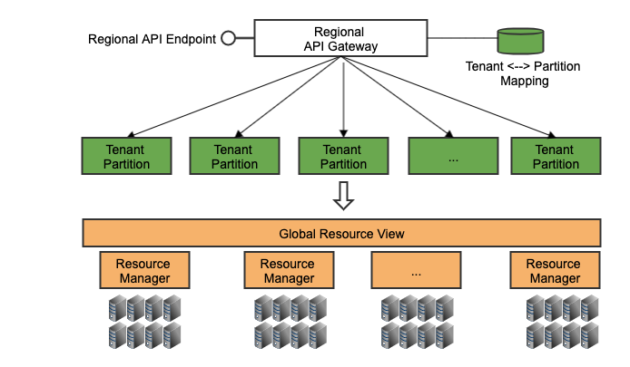
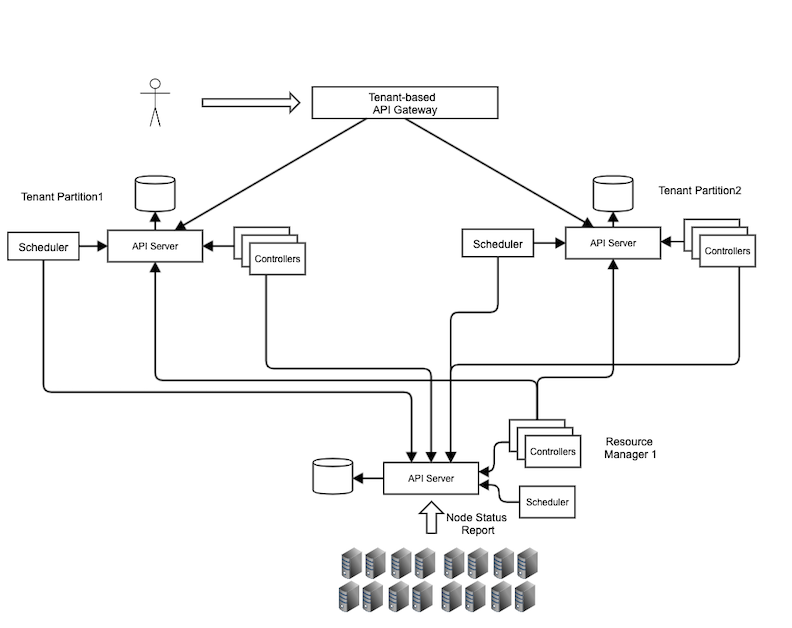
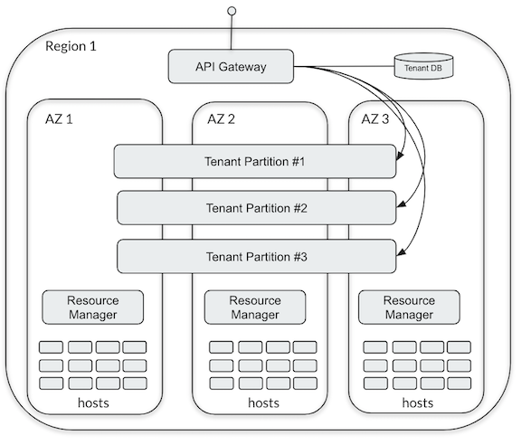

# Arktos Scale-Out Design

Xiaoning Ding

This document describes the Arktos scale-out design, and how it supports a highly scalable and a highly available regional control plane for cloud compute service.

## Scenario

The typical scenario we are trying to support is the following: 

* A cloud provider has hundreds of thousands physical machines (hosts) distributed in different data centers in a geographic region. Each data center belongs to a certain availability zone (AZ) within the region.
* The cloud provider deploys Arktos as the control plane to manage all these hosts.
* Arktos provides an API abstraction to the cloud users, who call the API to deploy workloads. These workloads may have AZ constraints specified by users. For example, to automatically distribute the pods of a replicaSet across different AZs.

Note: In this document our discussion is limited to one region only. For multiple regions, each one of them will have its own copy of Arktos control plane deployment. In future documents we will discuss cross-region scheduling and data replication.

## Requirements

Arktos was originally evolved from Kubernetes. When we look at the Kubernetes architecture (referred to as "original architecture") for supporting above mentioned scenario, we found the following design gaps:

* Scalability: in the original architecture all API Server instances are identical. Each of them caches a full copy of all resource objects. Also, all the cluster data is stored in a single etcd cluster. This cannot scale up to hundreds of thousands of hosts.  

* Availability: Kubernetes is not partitioned. The entire cluster is one single fault domain. Serving all tenants in a single partition is very risky from business perspective. All tenants will be impacted if the partition goes down, which could be due to many reasons: hardware failures, software bugs, operation mistakes, etc.

In the past, we tried to use a federation-style architecture to address above problems. But we found various drawbacks including code duplication between two layers, latency overhead of the extra code path, etc. Therefore, in the proposed design we want a single-layer flat architecture.

Due to the above mentioned considerations, our design requirements are the following:

* A single flat control plane to manage all hosts in a region. 
* Scalability: support 1M tenants, 300K+ hosts, 9M pods (using the 1:30 host:pod ratio from Kubernetes community.)
* Availability: 
	* Any component failure should only result in failure of some tenants, not all the tenants. 
	* If one or more AZ goes down, the regional control plane should still work. Only the workloads running in that particular AZ should be impacted, and these workloads should be able to be re-scheduled to other AZs (if there are no AZ constraints on these workloads).

 
## Architecture

The below diagram shows a high-level overview of the design: 

  

 Figure 1 The architecture view 

The key idea is to split the entire control plane into multiple partitions by tenants and by hosts. And there is no single "system partition". Any partition can fail without bringing down the entire control plane.

There are two types of partitions in Arktos:  tenant partition and resource manager. They manage various workloads and scale independently:

* Tenant Partition: Handles workloads from tenant users, such as CRUD pods/deployments/jobs/statefulsets/. It stores all API resources belong to tenants, and serves all API requests from these tenants.
* Resource Manager: a resource manager manages a host group. It stores API resources related to these hosts, like nodes, node leases, etc. These resources don't belong to any tenant. A resource manager also serves the heartbeat traffic and status update traffic from all these hosts.

Tenant partitions and resource managers can scale independently from each other:

* If we have more hosts, we deploy more resource managers.
* If we have more tenants or tenant workloads are high, we deploy more tenant partitions.

## Implementation

#### Component View

The below diagram shows a component-level view of the control plane, with an example of two tenant partitions and one resource manager:

  

 Figure 2 The component view 

#### Tenancy Model

Tenants and tenant partitions are M:1 model. One tenant belongs to one tenant partition and only one tenant partition. While one tenant partition holds multiple tenants, typical thousands or tens of thousands, depending on the planned partition capacity. For large tenants (so called VIP tenants), they can have their dedicated tenant partitions. 

A tenant is assigned to a certain tenant partition during the tenant creation time. The assignment rule is arbitrary and can be based on any policy (naming-based, round robin, load balanced, random, etc).

Note: for simplicity purpose we don't support cross-partition tenants or tenants movement in this design. We will address this in future, if needed.

#### API Gateway

It's a stateless service. Multiple identical gateway instances can be deployed to distribute traffic. There is no limit on how many instances can be deployed. 

Notice:

* API gateway is only for control plane requests. It doesn't serve data plane traffic.
* Internal clients (such as system admins and SREs) are able to connect to tenant partitions and resource managers directly. 

Like most existing API gateways, Arktos API gateway perform duties like authentication, authorizing, request dispatching, auditing, rate limiting, etc. 

On the API gateway side, a mapping (tenant name <---> Partition ID) is stored within an etcd cluster. 

Assuming the average tenant name length is 64 bytes and tenant ID is represented as a 4-byte int. For 1 million tenants and 1000 partitions, the required storage size is about 1M * (64+4) = 68M. If we use tenant ID (GUID) in the request URL, the map size will be reduced to around 20M (1M * (16+4)).

The size of map can easily be fully loaded into the memory of each API gateway instance, and maintained as a hash map in the memory. So that we can do an O(1) hash lookup for each incoming request. 

Any map entry changes will be synched to all API gateway instances via list/watch mechanism.

#### Tenant Partition

A tenant partition is a mini-cluster. It serves requests from tenant users, manage resources under the corresponding tenant spaces. Typically a tenant partition should be able to support tens of thousands of tenants.

As a mini-cluster, a tenant partition contains the following components:

* An etcd cluster
* One or multiple identical API Servers
* Active-standby Controller manager process: all controllers except node controller and daemonSet controller.
* One or more active-standby schedulers

The system space in a tenant partition only stores "tenants" objects. 

#### Resource Manager

A resource manager is also a mini-cluster to manage a group of hosts. Its responsibility includes:

* Serve the heat-beat and status requests from all hosts
* Manage the daemonSet resource
* Accept resource queries from all tenant partitions

For now, only the node, node-lease, daemonSet and their dependent resources under system space are supported. 

A resource manager contains the following components:

* An etcd cluster
* One or multiple identical API Servers
* Active-standby Controller manager process
* Active-standby scheduler

## Required Changes

#### Kubelet
* Use a dedicated kube-client to talk to the resource manager.
* Use multiple kube-clients to connect to multiple tenant partitions.
* Track the mapping between tenant ID and kube-clients.
* Use the right kube-client to do CRUD for all objects.
* Dynamically discover new tenant partitions based on CRD objects in its resource manager.

#### Controller Managers

* For node controllers (on resource manager side):
	* Use a dedicated kube-client to talk to the resource manager.
	* Use multiple kube-clients to talk to multiple tenant partitions.
	
* For other controllers:
	* If the controller list/watches node objects, it needs to use multiple kube-clients to access multiple resource managers.
	
* Further perf and scalability improvements:
	* Partition or not cache all node objects in a single process.	

#### Scheduler
* Use a dedicated kube-client to talk to its tenant partition.
* Use multiple kube-clients to connect to multiple resource managers, list/watching nodes from all resource managers.
* Use the right kube-client to update nodes objects.
* Further perf and scalability improvements:
	* Improve scheduling algorithm to reduce the possibility of scheduling conflicts.
	* Improve scheduler sampling algorithm to reduce scheduling time.

#### API Server
API Server mostly remains unchanged. But some scenarios (like kubectl log/attach) it needs to talk to a kubelet directly:

* Find the right kubelet endpoint when it needs to talk to a kubelet instance

#### API Gateway

So far Arktos hasn't planned to build our own API gateway software. In scalability test we are using HAProxy. 

For production environment, public clouds usually already have its own API gateway service. We just need a plugin to do the tenant ID and cluster ID mapping. 

## Deployment

The below diagram shows an example high-available deployment of Arktos control plane:

  

 Figure 3 The deployment view 

This deployment has the following considerations:

* Each tenant partitions is deployed in an active-active approach cross multiple AZs.

	Tenant partitions need to survive one or more AZ failures. They hold all the user job information. As long as tenant partitions are still up and there are available AZs, user jobs can be restored.
	
	Tenant partitions can also be deployed on AZ level, but that will greatly reduce its availability.

* Each resource manager is deployed on AZ level. 

	A resource manager only needs the same availability level with the hosts it managed. It doesn't help if all hosts go down but the resource manager is still up.
	
	Deploying resource manager on AZ level will reduce the communication latency between resource manager and the hosts it managed, and therefore improve heartbeat robustness. It also reduces the cross-AZ traffic cost. 

With this deployment, one AZ's failure will only impact the workloads running in that AZ. The regional control plane is still running, and the control plane can restart the workloads in another AZ (if the workload doesn't have an AZ constraining).

## Frequently Asked Questions

* Is this regional control plane still a single cluster?

	Yes, it is. Because all hosts are managed as a single shared resource pool, and all scheduler instances have a global view of all hosts.

* Is this a federation architecture?

	No. Federation is an architecture on top of multiple autonomous independent clusters, with each cluster managing their own hosts. As explained earlier, Arktos scale-out architecture is a single cluster. 

* Can different partitions have different deployment configurations?

   Yes. A partition's configuration is local to this particular partition. Different partitions can have totally different configurations. 
   
   For example, tenant partition #1 could be a large partition and therefore has 5 replica of API Server, while tenant partition #2 has only 3 replica of API Server. Meanwhile, tenant partition #1 can deploy two scheduler instances if a single scheduler cannot meet the throughput requirement on that partition.
   
* Will this architecture increase the possibility of scheduling conflicts?

	It depends. The conflict possibility is related to the number of scheduler instances. If we deploy many small tenant partitions, there will be unnecessarily many instances of schedulers. In this case, the conflict possibility increases. 

	But we expect usually tenant partitions should be reasonable large. So the change of scheduling conflict should be same. In other words, anyway we need this many scheduler instances for the entire region's workloads. 

* Can we deploy all scheduler instances together, instead of deploying them by partitions?

  It's possible.  In this design we make each partition has its own schedulers for easy deployment, easy management and more isolation. 
  
* What's the correlation between a resource manager and an AZ?

  Resource manager is a software component that manages a group of hosts. You can deploy a resource manager to manage hosts from one AZ or multiple AZs, depending on your deployment plan.
  
  We recommend deploying one resource manager per AZ and each resource manager manages the hosts from its own AZ. The reasons are: 1) Host heartbeats and status reports will be more stable if we keep resource manager and its hosts physically close to each other. 2) This will reduce cross-AZ traffic cost.  3) No cross-AZ fault tolerance is needed for a resource manager if it only manages hosts from its own AZ. 
  
  If you deploy a resource manager to manage hosts from multiple AZs, you need to ensure the resource manager is deployed in a cross-AZ fault-tolerance way, so that the resource manager can survive the failures in any of these AZs.
