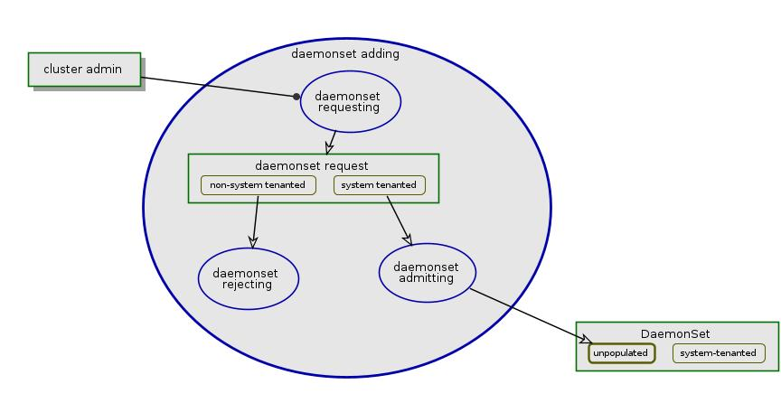

## DaemonSet in Arktos

Due to the nature Arktos being a multiple-tenanted system, DaemonSet is only allowed in system tenant; only cluster admin is permitted to create/delete DaemonSet resources.

### DaemonSet in Scale-up Arktos
Scale-up Arktos has single master. With the admission controller blocking non-system tenant DaemonSet enabled by API Server, Arktos is able to ensure DaemonSet proper support.

### DaemonSet in Scale-out Arktos
[Scale-out Arktos](arktos_scale_out.md) may have multiple tenant partitions and resource managers; each of them has Kubernetes master components including API Server, controller manager, etc. DaemonSet resource will be managed by tenant partition, as the controllers in tenant partition have the global view of Node resources.

In tenant partition, DaemonSet controller populates daemon Pods for the specific DaemonSet, using the global view of Nodes; its scheduler schedules each daemon Pod to the proper Node subsequently.

On the node, kubelet gets notification of daemon Pod's creation, then prepares environment for the Pod, finally starts the pod in the prepared environment. The environment preparation includes fetching the specified API resources (like secret, configmap) as defined in Pod spec and provisioning in form of files/data in node's filesystem. In order to ensure API resources are fecthed from the proper tenant partition, kubelet shall maintain the mapping of daemon Pod to tenant partition origin; whenever the needed resource of the daemon Pod is fetched, kubelet shall lookup the mapping and use that of the proper tenant partition.

### Reequired Changes
The minimum changes required to support DaemonSet of Arktos

#### API Server (admission Controller)
* The admission controller module to block non-system tenanted DaemonSet.
* API Servers (at least of tenant partitions) enables the admission controller when it is started

Below is the diagram of DaemonSet admission:

  

#### Kubelet
Kubelet shall be able to identify the API resources (configmap, secret etc) from the same tenant partition as the daemon Pod to be started, in environment preparing process.

Below is the diagram of kubelet environment preparing process:

  

