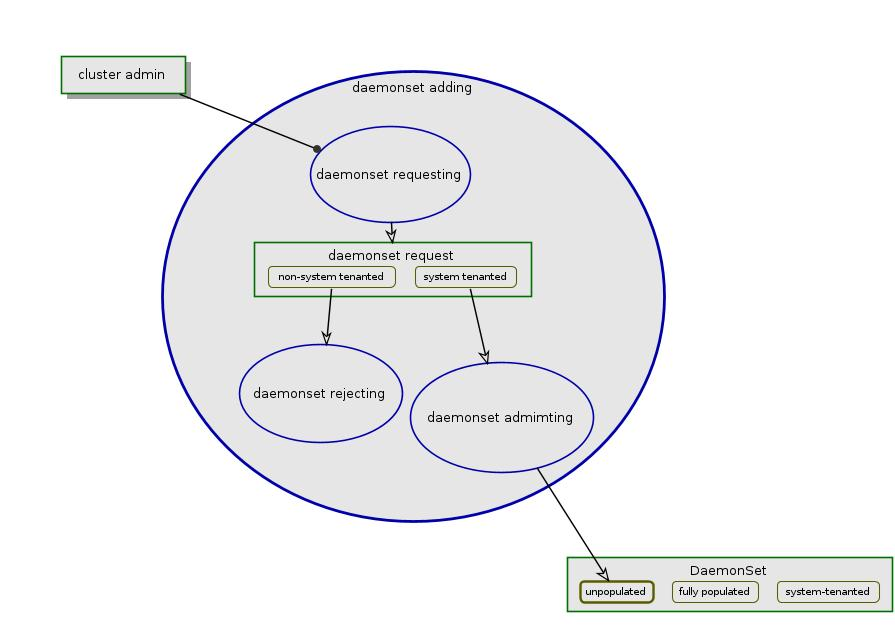
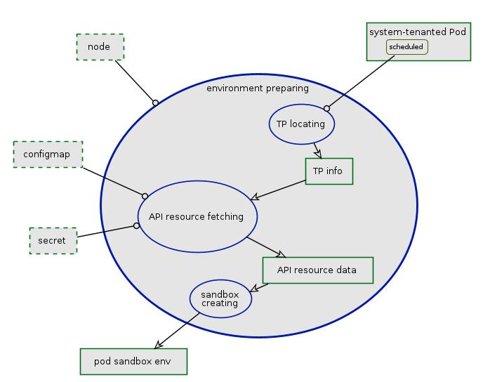
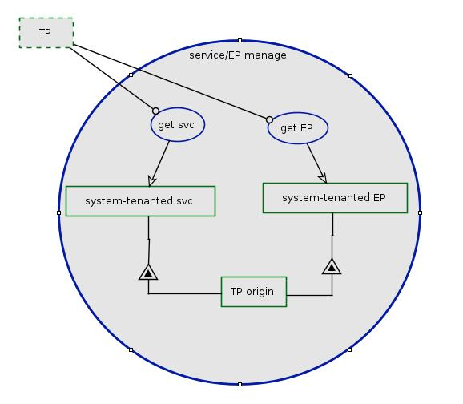

# System-tenanted Pods in Arktos

System-tenanted pods are pods that are of the special tenant, "system". These pods are typical for cluster infrastructual or management tasks.

Due to the nature Arktos being a multiple-tenanted system, DaemonSet is only allowed in system tenant; only cluster admin is permitted to create/delete/update DaemonSet resources. DaemonSet pods are system-tenanted, too.

This document describes what parts of Arktos need to have to support system-tenanted pods. 

## What is not covered yet
At this stage of Arktos, PVC/PV for storage volume is not fully supported - out of scope of this design.

Analysis of the impact caused by adding/removing TP from scale-out system is not in its scope, either.

## System-tenanted Pods
In case of the tenant partition that manages system-tenanted resources fails, other tenant partitions, if applicable, are available for cluster admin to manage the resources of system tenant; the resources previously managed on the failed TP may not be updated, system functionality being degraded. There is possibility to recover the affected resoures to functioning TP, but it is out of our current design interests.

Arranging system-tenant Pod and its supporting resources within the unit of TP as depicted above does not put unnecessary constraint of how system tenant being managed across TPs. Whether Arktos scale-out chooses to have multiple TPs with each being able to manage its own system tenant resources, or to have a single dedicated Partition for system tenant resources likely enhanced by some sort of HA, this design stands - as long as system-tenanted Pod and its supporting API resources are managed by the same TP.

## System-tenanted Pods in Scale-up Arktos
Scale-up Arktos has single master; system-tenanted Pods are supported.

## System-tenanted Pods in Scale-out Arktos
[Scale-out Arktos](arktos_scale_out.md) may have multiple tenant partitions and resource partitions; each of them has master components including API Server, controller manager, etc.

System-tenanted Pods, like other resources, are named within the boundary of individual tenant server; it is possible for two or more pods have same tenant-namespace-name, which would confuse kubelet to have problem managing them.

Usually a Pod requires other API resources to provision its runtime sandbox with specific environmental data. For instance, configmap resource is used to initialize as app config file, secret as app sensitive data. These supporting resources shall be at the same Tenant Partion as of the pod.

On the node, kubelet gets notification of system-tenanted Pod's creation, then prepares environment for the Pod, finally starts the pod in the prepared environment. The environment preparation includes fetching the specified API resources (like secret, configmap) as defined in Pod spec and provisioning in form of files/data in node's filesystem. In order to ensure API resources are fetched from the proper tenant partition, kubelet shall maintain the mapping of system-tenanted Pod to tenant partition origin; whenever the needed resource of the Pod is fetched, kubelet shall lookup the mapping and use that of the proper tenant partition.

Besides, when service is exposed out of system-tenanted pods, kube-proxy, if it is a component in the scale-out env, suffers the same name collision problem.

### DaemonSet
DaemonSet is managed by the DaemonSet controller of individual tenant server, and the DaemonSet pods (being system tenant) are CRUD accordingly. The Daemonset pods are named within the single API server; the name collision problem is with DaemonSet pods, too.

Each node may typically run daemon Pods of all DaemonSet from all the TP's. These daemon Pods should not conflict with each other to compete for same system resources, e.g. no two are trying to set up network as CNI plugin; whether their DaemonSet names are same or not is immaterial.

Providing a centralized DaemonSet management tool on top of all and every TP is convenience gain for cluster admin; however it is beyond the core design. The rudimentary utility using kubectl config context is able to mitigate before a better solution is available.

### Alternatives
We considered other options for DaemonSet in scale-out Arktos.

**DaemonSet in Resource Partition**

DaemonSet resource is managed combinely by all resource partitions; tenant partition is not involved. Each resource partition has its own copy of the DaemonSet resource; its DaemonSet controller and scheduler manage the DaemonSet in (local) scope of its Nodes.

This architecture has some defects:
* Lack of built-in mechanism to distribute and sync DaemonSet copies to all tenant partitions;
* Increased operation complexity: multiple RP's each runs master controllers;
* Decreased scheduler accuracy: scheduler of RP schedules daemon Pods which cannot have the resource allocation reflected in the scheduler of TP, which leads to inaccuracy of the deceived resources.
* Overlap of TP/RP: Pod/configmap/secret may be managed by TP or RP - depending on whether they are DaemonSet related or not, which tarnishes the clear cut of TP/RP.

**DaemonSet in Hybrid**

This is a variant of the above-mentioned DS in RP: cluster admin manages DaemonSet at tenant partition; system implements a built-in distribution mechanism (DaemonSet distribution controller) to push DeamonSet change to all resource partitions.

This architecture mitigates the DS sync problem, but it brings more incompatibility of scale-out and scale-up, as scale-up has no such sync in the first place.

## Reequired Changes
The minimum changes required to support system-tenanted Pods and DaemonSet of Arktos

#### API Server (admission Controller)
* The admission controller module to block non-system tenanted DaemonSet.
* API Servers (at least of tenant partitions) enables the admission controller when it is started

Below is the diagram of DaemonSet admission:

  

#### Kubelet
Kubelet shall be able to identify the API resources (configmap, secret, PVC etc) from the same tenant partition as the system-tenanted Pod to be started, in environment preparing process.

Below is the diagram of kubelet environment preparing process:

  

There are two significant required functionalities for kubelet, at high level:
1. Keeping track of system tenant Pod's TP origin.
   
One trivial way is maintaining a map in memory for daemon Pod by UUID to TP origin.
   
For regular tenanted Pods, either deriving TP based on tenant name or leveraging the origin tracking is fine. It is segguested to start with that regular tenanted Pods still use the simple TP-derived-from-tenant-name mechanism. It can be revisted in later the general system tenanted resource management design.
2. Retrieving supporting resources by TP origin.
   
Secret and configmap resources each is managed via a local cached store being replenished by external API servers (TP's). Current store implementation simply identify TP by tenant name of the resource. To accomodate the the needed change, the cache store should accept requests to get resource with specified TP origin; it should be able to keep system-tenanted secret or configmap without losing their TP origins; also it should use the resource-specific TP origin to replenish the staled resource instead of the simple tenant-name derived one.
   
The specific detail the changes of store should be carefully considered before the kubelet module implementation.

#### Kube-proxy
In scale-out env, for services that are exposed from the system-tenanted Pods, kube-proxy shall be able to tell which TP a certain system-tenanted service is from and locate the endpoints from that TP only. Kube-proxy needs to have similar origin tracking mechanism.

The TP origin is the significant new property of system-tenanted service nd endpoint, as in 

  
