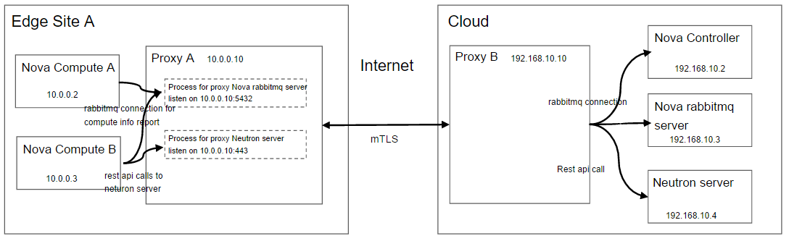
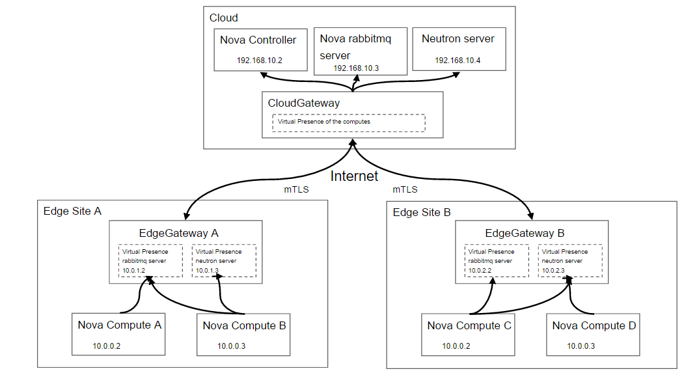

# Arktos Cloud-Edge Communication Framework

## Motivation

In edge cloud scenario, cloud infrastructure components are deployed in the cloud and edge. For example, AWS Outposts, the outpost rack(include the compute, network, storage servers which are used for edge cloud infrastructure) will be deployed in customer data center, and it can be managed by AWS Outposts, customers can run vms or containers on it through AWS Outposts services. Another example is Aliyun ENS, it can help customers to deploy vms on the edge(in CDN datacenter where is closer to customers than Aliyun public regions). 

Cloud is doing edge server management, and the services running in the cloud and edge need to communicate with each other. For example, the compute agent/service running on the edge servers may need to report compute server info to the cloud for vm scheduling, and the vm services(like openstack nova) running in the cloud may send vm deploy request to compute agent/service running the edge, to do the vm deploying.

There are some ways to provide the service communication between the cloud and edge. For example, AWS Outposts recommend that customers can use direct connect or vpn for the remote services management.
In most cases, use vpn or direct connect for the cloud-edge communication may cause some problems:
* IP address conflict. We need to do the ip addresses planning before we deploy the services to the edge if we use vpn, all the ip of the services need to be different. In some edge scenario, the edge server is deployed in customers' data center, and the available IP addresses may be fiexd or conflict with the cloud or other edge site.  
* Security problem. Because edge sites are usually located in customers' data center or carriers' data center. For cloud provider, they are defined as an untrusted environment. So relying on network perimeter technolygies(VPNs etc.) is a security risk, it expose the whole network of the cloud to the untrusted edge site.

This proposal aims to outline a design for cloud-edge communication framework and it can solve the above problems

## Goals

* Support communication for the services between the cloud and edge
* There is no need to do ip planning for these services between the cloud and edge, no ip conflict problems
* Security proposal, support zero trust

## Proposal A

In this proposal, we want to implement it by service proxy. For solve the problems, we do not expose network to the cloud or the edge, we can "expose service". For example, if there is a service in the cloud, and the edge server need to visit it through our communication framework.
We can add a proxy A in the edge, and it can proxy the service request from the edge server to the cloud service.
But the target service in the cloud is usually not exposed to the Internet. So we need add another proxy B in the cloud, and the proxy A can proxy the service request to proxy B, and the proxy B can proxy the service request to the target service.

edge server -----> Proxy A(in the edge) <----------> Proxy B(in the cloud) ------> target service

If we want to support all the communication between the cloud and edge, we need to implement the "proxy" to proxy the service request between the cloud and edge.
Usually, there are many kinds of services communication between the cloud and edge. For example, the communication may be rest API calls, gprc, message call(kafka/rabbitmq) or something else.

How to implement the proxy?

Option 1: The proxy adapt the communication protocols(network layer 7).

For example, if the proxy want to support rest calls(http/https) between the cloud and the edge. The proxy works as a http/https server, it can proxy the rest calls to the destination site.
And the proxy can distinguish the target service from the request url parsing to support multiple backend http servers.
For https request, the proxy play the middle man role to do the traffic encryption, decryption and forward.

If the proxy want to support message(rabbitmq/kafka) between the cloud and the edge. The proxy works as a amqp/kafka server, it can proxy the message call/connection to the destination site, it need to understand the amqp/kafka protocol, to do the connection and request forward.
And also there are encryption/decryption problems(MitM). It is hard to support all the communcation protocols in this way.

So if the rest call(http/https request) is the only communication type between the cloud and the edge, maybe it is a simple/good choice. 

Option 2: The proxy works at network layer 4, do the udp/tcp proxy.

For example, we want to support rest calls(http/https), message queue connection(rabbitmq/kafka), and something else based on the udp protocol.
The proxy works as a udp server, and it forward the udp connection/traffic to the destination site.

It works just like a nginx, but there are some differences:
1. It does not proxy the traffic to the destination service directly, but to the other proxy in other site
2. It does not work only for one or two services, and with static configuration. It needs to support multiple services at the same time, and the services can be dynamic add or remove.
It needs to solve the port allocation and traffic encryption/decryption problems

 

## Proposal B

We want to implement the communication framework based on the network layer 3, and also we need to solve the ip address conflict and security problems. We can use ip translation to do this. 

We need to add the gateway/proxy for the edge site and the cloud for the communication, we call it edgegateway in each edge site, and in addition to communication, cloudgateway is responsible for central control. We don't expose the network to the cloud or the edge site(cause too much attack surface), we expose the services to the gateway.  

Here we want to introduce a concept "virtual presence":
* It is a local virtual presentation of remote services
* It is full isolation of remote servers

If the service is exposed to the edge site, there will be a virtual presence for the service in this edge site. The clients in this edge site which want to communicate to the service will be told to communicate to the virtual presence of the service which is on the gateway of the edge site. And our gateway will forward traffic in secured tunnel using local virtual presence ip address to the destination gateway and services.

 

Here is an example for explaining it, in the edge cloud, if we are using openstack to do the vm deploying. In the cloud, there are openstack controller components, for example nova-controller(nova-api/scheduler/conductor), rabbitmq-server, neutron-server and something else. And there are nova-computes running in the edge site. For deploying vm, nova-controller needs to send the vm deploying request to the nova-compute through rabbitmq, and nova-compute need to request to the neutron-server for port creating through rest calls. Only for these two cloud-edge communication: 
1. There is ip conflict in edge site A and edge site B, the nova-compute server use the same ip address for communication to the cloud.
2. We can expose the rabbitmq service which is in the cloud to the edge site A and edge site B, it will expose the rabbitmq service url for the edge site. There will be a virtual presence for the rabbitmq service in edge site A, and another virtual presence for the rabbitmq service in edge site B.
The virtual presence will be assigned a local virtual ip address of the edge site by the controller(CloudGateway), the local virtual ip is in the edge site address spaces which is predefined for the edge site, and it is just used in the edge site, so it is no need to global planning for the cloud.
3. The nova compute need to use the local dns which is a component of the edgegateway A. Edgegateway A will resolve the rabbitmq service url to the virtual presence ip address which is routed to the edgegateway A. 
4. The nova compute in edge site A will communicate to the virtual presence of rabbitmq service with the rabbitmq url. And the traffic will be routed to the edgegateway A. Edgegateway A will forward traffic in secured tunnel using local virtual presence ip address to cloudgateway.
5. The cloudgateway will do the ip translation and forward traffic to the rabbitmq.
6. The communication for nova-compute and neutron-sever is the same traffic flows with another virtual presence.  

All the traffic flow and ip translation are controlled by the cloudgateway. The cloudgateway and edgegateway uses certificate to identify itself(each gateway has it own), and gateways communicate using mTLS. If an edge site is compromised, its edgegateway certificate can be revoked immediately, and it can no longer communicate with the management, and it is possible to expose different management services based on the individual edge site certificate.

## Proposal Comparison & Decision

Here we add the vpn solution in it for better comparison(VPN solution is just deploy the vpn(ipsec vpn or something else) on each edge site and the cloud, and the communication will be directly from the client to the service using their management ip addresses)

| Solution     | Pros  | Cons |
|:---          |:---  |:---|
| Proposal A   | <ul><li>No ip conflict problem, no network planning required</li></ul> | <ul><li>Traffic is proxy-terminated(MitM)</li><li>Hard to implement every protocol for the communication?</li></ul>    |
| Proposal B   | <ul><li>No ip conflict problem, no network planning required</li><li>Can support any type of communication</li><li>Networks remain completely isolated(no perimeter to be breached)</li></ul>|  |
| VPN solution | <ul><li>End-to-End encrypted(no MitM)</li><li>Can support any type of communication</li></ul>| <ul><li>Need ip planning(ip conflict risk)</li><li>Based on network perimeter, too much attack surface</li></ul>|

We will have use proposal B at phase I for the communication of the management infrastructure components.

## Implementation Steps：

