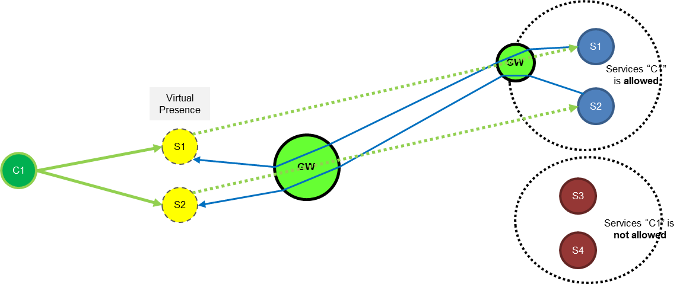
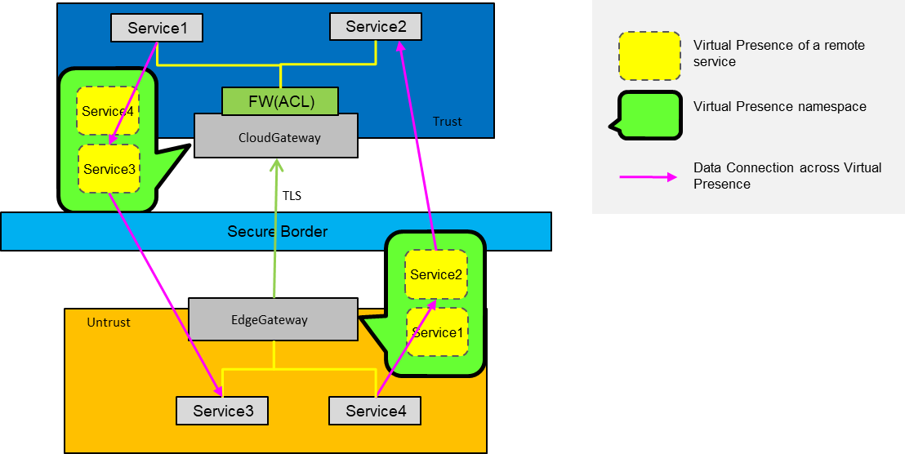
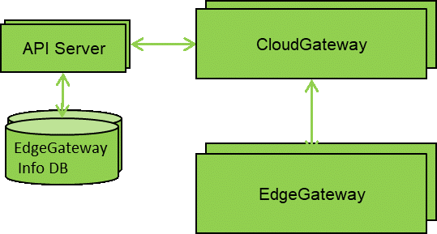

# Arktos Cloud-Edge Communication Framework

## Motivation

In the edge cloud scenario, worker node of arktos can be run on the edge closer to the user, such as CDN machine room of the operator, user data center and other edge sites, and virtual machines, containers and other resources are provided at the edge. Through the edge network with low delay, the operation of delay sensitive application is satisfied, such as interactive live broadcasting, cloud games and real-time trading systems etc..

In this way, arktos and other cloud management infrastructure components will remotely manage the service components in these edge sites across the public network or private line network. It is necessary to have a way to provide communication access for these basic management components or services between cloud and edge.

Because the cloud and edge is located in the network boundary of different security levels, the management components or services in the edge site and the central cloud can be connected through the VPN layer of the management plane, and then cross boundary security protection can be provided through the firewall ACL.

However, there may be many problems when VPN is used to directly connect the components/services of different security levels:

* It is too risky to directly expose the central cloud management network/IP to users
* IP needs to be planned globally in advance to ensure that the management components/service IP of the central cloud and each edge site do not conflict
* Network changes can be difficult

This proposal aims to outline a design for cloud-edge communication framework/service to solve the above problems

## Goals

* Support communication access capability of cloud-edge basic management components
* Support independent IP addressing and IP address convergence of edge management components/services
* Minimize attack surface, zero trust security

## Proposal

The following two solutions do not conflict with each other. The former can converge IP addresses to resolve IP address conflicts. However, the communication needs to be first sent to the gateway and then to the destination service. The latter cannot converge IP addresses but can resolve IP address conflicts. The latter provides end-to-end communication.

### Proposal A

The communication of cloud edge components/services is realized based on L4/L7 proxy, which is similar to kubedge's cloud-edge message channel.

Cloudgateway and edgegateway are introduced into the central cloud and each edge site respectively. The edge site edgegateway supports connecting to the cloud gateway of the central cloud when it is started. The service communication between cloud and edge needs to go through these two gateways before arriving. Service access interfaces are provided on these two gateways to receive requests and route requests to target services.

* Cloudgateway and edgegateway are installed and run in the central cloud and each edge site respectively
* Edgegateway of Edge site can actively establish encrypted links with cloudgateway on the central side, and support two-way message transmission
* Register the services of edge site and central cloud to cloudgateway
* Edgegateway in the edge site acts as the service in the central cloud, and exposes the service access interface of the central cloud to the service in the edge site
* Cloudgateway in the central cloud acts as the service in each edge site and exposes the service access interface of the edge site in the central cloud

### Proposal B

The access of cloud edge components/services is realized based on L3 layer network communication, but the network/IP is not exposed to the remote end, but the components/services are exposed to the remote end.

Consider providing the concept of virtual presence, which is the local virtual presentation of remote services. In this way, virtual presence can be regarded as a local service with local IP addresses. These IP addresses have nothing to do with the network where the remote service is located, and can be allocated independently. In this way, the problem of unified planning of IP address of VPN solution in the whole network can be solved at the network level. From the perspective of security, virtual presence is completely isolated from the remote service. The client cannot directly access the network where the remote service is located. If the client is attacked, it can not directly attack the server.

Gateway (cloudgateway/edgegateway) is introduced into the cloud and each edge. Virtual presence of remote service is provided on these gateways, and service components that need communication between cloud and edge site are presented respectively to realize communication access of cloud edge service：

* Edgegateway is installed and run in the central cloud and each edge site respectively, so that these edge sites can access to the central cloud through edgegateway
* Create edgesite objects to the system and associate edgesite with these edgegateway
* All components in the cloud and edge that need mutual access are registered with the central cloud cloudgateway in the form of service, and the access policies of these services are configured
* The central cloud synchronizes the policy to the corresponding edgegateway, which provides virtual presence for the edge through translation mechanisms to simulate local traffic flow

### API Definition

Using the architecture of arktos, the API is exposed through arktos API server, including service expose, policy management, site management, virtual presence management, etc

#### API object

Here are the API samples in arktos：

	{
	    "kind": "ESite",
	    "apiVersion": "v1",
	    "metadata": {
	        "name": "TokyoChibaSite1"
	    }
	}
	
	{
	    "kind": "EGateway",
	    "apiVersion": "v1",
	    "metadata": {
	        "name": "TokyoChibaGateway"
		},
		"ip": "202.168.0.10",
		"virtualPresenceIPcidr": "192.168.0.0/24",
		"eSiteName": "TokyoChibaSite1"
	}
	
	{
	    "kind": "VirtualPresence",
	    "apiVersion": "v1",
	    "metadata": {
	        "name": "vp1"
		},
		"virtualIp": "192.168.0.10",
		"eServiceName": "TykyoChibaNginx"
	}
	
	{
	    "kind": "EService",
	    "apiVersion": "v1",
	    "metadata": {
	        "name": "TykyoChibaNginx"
		},
		"port": 8080,
		"protocol": "TCP",
		"ip": "10.0.0.10",
		"domainName": "EServiceNginx"
		"eSiteName": "TokyoChibaSite1"
	}
	
	{
	    "kind": "EServer",
		"apiVersion": "v1",
		"eServerName": "Server1",
		"ip": "10.0.0.20",
		"eSiteName": "TokyoChibaSite1"
	}
	
	{
	    "kind": "EPolicy",
	    "apiVersion": "v1",
	    "metadata": {
	        "name": "Policy1"
		},
		"allowedServers": ["Server1"]
	}
	
	{
	    "kind": "ServiceExpose",
	    "apiVersion": "v1",
	    "eServiceName": "TykyoChibaNginx",
		"dnsName": "url1.test.com",
	    "eSites": ["TokyoChibaSite1"],
	    "ePolicys": ["Policy1", "Policy2"]
	}

#### API Structs

Here are the ESite data struct introduced into arktos，Represent each site, and the central cloud region also belongs to the site：

	type ESite struct {
		metav1.TypeMeta
		metav1.ObjectMeta
	}

EGateway data struct：

	type EGateway struct {
		metav1.TypeMeta
		metav1.ObjectMeta
	
		// Ip address of the gateway
		Ip string
	
		// Virtual presence ip address cidr of this gateway
		VirtualPresenceIPcidr string
	
		// ESiteName associated to the gateway
		ESiteName string
	}

VirtualPresence data struct：

	type VirtualPresence struct {
		metav1.TypeMeta
		metav1.ObjectMeta
	
		// Ip address of the virtual presence
		VirtualIp string
	
		// Associated service name
		EServiceName string
	}

EService data struct：

	type EService struct {
		metav1.TypeMeta
		metav1.ObjectMeta
	
		// Protocol of the service
		Protocol string
	
		// Port of the service use
		Port int32
	
		// Ip of the service
		Ip string

		// DomainName of service
		DomainName string
	
		// Associated site name
		ESiteName string
	}

EServer data struct：

	type EServer struct {
		metav1.TypeMeta
		metav1.ObjectMeta
	
		// EServerName of the server
		EServerName string
	
		// Ip of the service
		Ip string
	
		// Associated site name
		ESiteName string
	}

EPolicy data struct：

	type EPolicy struct {
		metav1.TypeMeta
		metav1.ObjectMeta
	
		// Allowed server names of this policy
		AllowedServers []string

		// Allowed site names of this policy
		AllowedSites []string
	}

ServiceExpose data struct：

	type ServiceExpose struct {
		metav1.TypeMeta
		metav1.ObjectMeta
	
		// Associated service name will be exposed
		EServiceName string
	
		// Dns Name of the service will be exposed
		DnsName string
	
		// ESite name list
		ESites []string
	
		// EPolicys name list of the service will be allowed
		EPolicys []string
	}

## Implementation Steps：

1. Implement the basic cloud-edge communication framework
	* Add CloudGateway/EdgeGateway component, it integrates the CloudHub and EdgeHub modules of KubeEdge, supports the establishment of encrypted cloud-edge communication channels, and supports message routing, EdgeGateway access management, and certificate management (930)
	* Expand channel to support tunnel mode, support the transmission of binary data through tap/Tun devices (930)
1. Implementing cloud edge service communication in phases based on proxy mode
	* Add API and object of ESite and EGateway (930)
	* EdgeGateway supports proxy rest API calls, CloudGateway supports proxy routing the request to the destination service, and supports the transmission of HTTP/HTTPS protocol communication (930)
	* CloudGateway supports proxy rest API calls, and EdgeGateway supports proxy routing the request to the destination service (930)
	* Extend to support proxy for other protocol types(L7/kafka、L4/TCP UDP) (TBD)
1. Implement cloud-edge communication based on virtual presence
	* CloudGateway supports Virtual Presence management, adds Virtual Presence objects and APIs, supports addition, deletion, modification and query of Virtual Presence, and supports the allocation of virtual IP (930)
	* CloudGateway supports policy management, adds epolicy objects and APIs, and supports policy addition, deletion, modification and query (930)
	* CloudGateway/EdgeGateway supports local OVS operation (1030)
	* CloudGateway supports services exposure, adds ServiceExpose, EService, EServer objects and APIs, supports configuring traffic translation on CloudGateway based on policy and Virtual Presence, and sends translation messages to various EdgeGateway (1030)
	* EdgeGateway supports receiving translation messages and performing local Virtual Presence and policy configuration (1030)
	* EdgeGateway supports obtaining full policy information from CloudGateway and executing local traffic translation (1030)
	* CloudGateway/EdgeGateway adds the local DNS function, which supports obtaining the Virtual Presence address corresponding to the service (1130)
	* End to end testing cloudGateway/EdgeGateway (1130)
	* Installation and deployment configuration of EdgeGateway/CloudGateway (1230)

