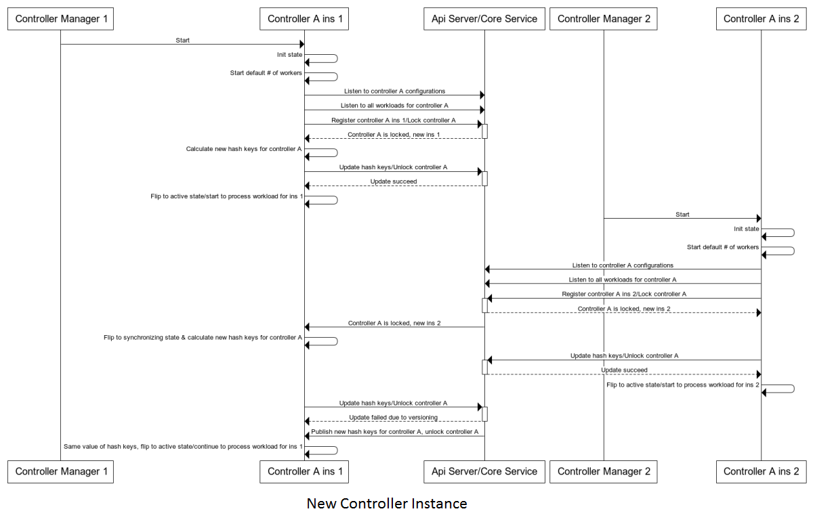
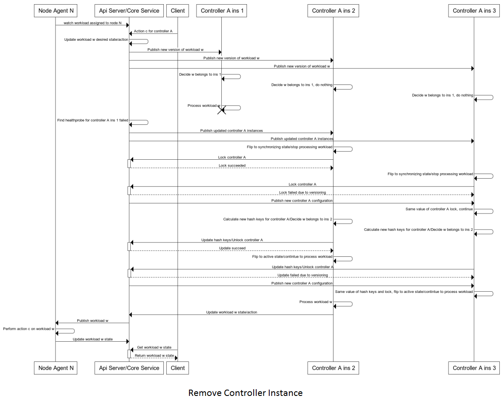

# Controller Manager
## Design Principles
* Allow multiple instances of controller managers run in parallel and all taking workload
* Each controller managers can host many types of controllers
* All controller managers are running on the same code base and can host different types of controllers; allow default configure and support live configuration changes
* Controller managers are not responsible for controller workload distribution
* Periodically report controller manager status to storage (via api server or core service)

## Configuration

Each controller manager instance (process) has the following fields:
* Type: specifies the default launch configuration, including which controller it will start and how many workers the controllers will have
* Id: instance type

```yaml
ControllerManagerDefault:
- controller-manager-type: pods
  controllers:
  - type: deployment
    workers: 5
  - type: scaleset
    workers: 10
- controller-manager-type: jobs
  controllers:
  - type: job
    workers: 5
  - type: cron-job
    workers: 5
ControllerManagerInstances:
- controller-manager-id: uuid1
  controller-manager-type: pods
  last-healthprobe-at: '2019-05-01 01:00:00'
  is-alive: true
  controllers:
  - type: deployment
    workers: 5
  - type: scaleset
    workers: 2
- controller-manager-id: uuid2
  controller-manager-type: jobs
  last-healthprobe-at: '2019-05-01 01:00:00'
  is-alive: true
  controllers:
  - type: job
    workers: 8
  - type: cron-job
    workers: 2

```

## Start & Update Workflow


# Controller

## Overview
* Solution 1 (plan B): supervised workload distribution
* Solution 2 (plan A): unsupervised (self organized) workload distribution
* Implementation Plan
   1. Original decision is from supervised to unsupervised
   1. Decide to first spend 2 to 3 months for POC unsupervised solution. If it is not feasible, with fall back to supervised solution

## Unsupervised Workload Distribution (Plan A)
### Data Registry
```yaml
Controllers:
- controller-type: VirtualMachine
  locked: false
  instances:
  - instance-id: uuid1
    last-healthprobe-at: '2019-05-01 01:00:00'
  - instance-id: uuid2
    last-healthprobe-at: '2019-05-01 01:00:00'
  - instance-id: uuid5
    last-healthprobe-at: '2019-05-01 01:00:00'
- controller-type: BareMetal
  locked: true
  instances:
  - instance-id: uuid3
    last-healthprobe-at: '2019-05-01 01:00:00'
  - instance-id: uuid4
    last-healthprobe-at: '2019-05-01 01:00:00'
```

### Ideas 
1. Upon controller start, get full set of workloads that are not completed. (Need to check workload state support)
1. Internal records of all none completed workloads with minimized attributes: workload id, namespace/name (cache key), created timestamp, status, current assigned controller instance id 
    1. Map of workload id -> workload record
    1. Map of controller instance id -> set of workloads
1.  Upon update of instances, recaculate workload ownership; for affected workloads, reassign
    1. Need algorithm to find delta

### Problems and Solutions
1. If controller instance updates happen frequently, there will be a lot of reassignment (internal caculation and memory operation)
    * Solvable by efficient delta algorithm
1. Memory usage for all workload storage
    * Need to estimate and performance test for the benchmark
1. Affected workloads need to be reread for status update 
    * this is avoidable for all reassignment.
1. Can controller be locked for a very long time when system is not stable?
    * Lock controller means there will be no processing of new workload. It does not block new controller registration or removal. Once controller instances are stablized, it will resume processing workloads.
    * Performance test need to simulate this scenario 
    

#### New Controller Instance


#### Remove Controller Instance


#### New Workload Request


### Algorithm
. Consistent hashing algorithm: [https://raw.githubusercontent.com/stathat/consistent/master/consistent.go](https://raw.githubusercontent.com/stathat/consistent/master/consistent.go)
