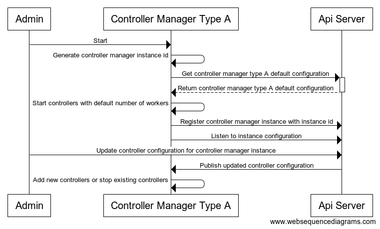
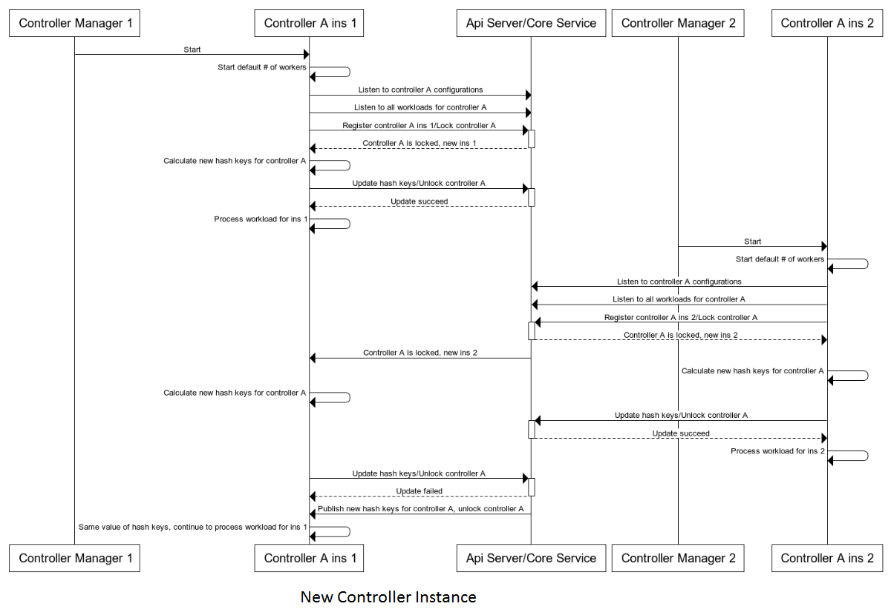
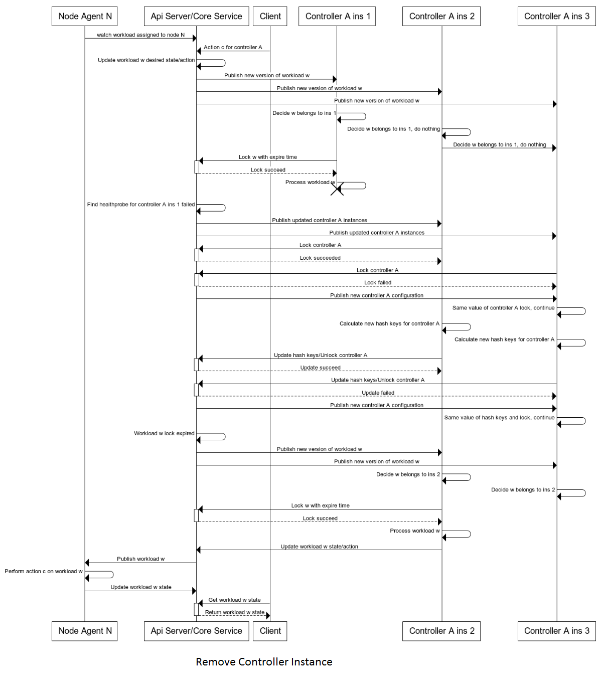
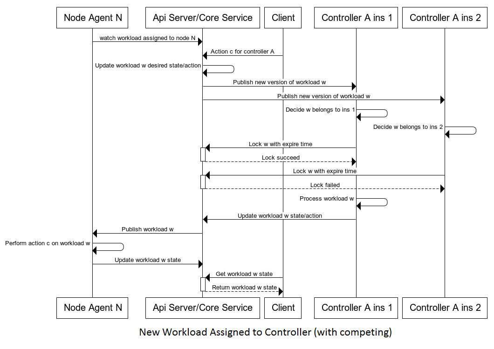

# Controller Manager
## Design Principles
* Multiple instances of controller managers
* Each controller managers can host many types of controllers
* No hard limit on which controller managers can host which controllers; allow default configure and support live configuration changes
* Controller managers are not responsible for controller workload distribution
* Periodically report manager status to storage (via api server or core service)

## Configuration

Each controller manager instance (process) has a type and id
* Type: specifies the default launch configuration, including which controller it will start and how many worker the controllers will have
* Id: instance type

```yaml
Default:
- controller-manager-type: pods
  controllers:
  - type: deployment
    workers: 5
  - type: scaleset
    workers: 10
- controller-manager-type: jobs
  controllers:
  - type: job
    workers: 5
  - type: cron-job
    workers: 5
ControllerManagerInstances:
- controller-manager-id: uuid1
  controller-manager-type: pods
  last-healthprobe-at: '2019-05-01 01:00:00'
  is-alive: true
  controllers:
  - type: deployment
    workers: 5
  - type: scaleset
    workers: 2
- controller-manager-id: uuid2
  controller-manager-type: jobs
  last-healthprobe-at: '2019-05-01 01:00:00'
  is-alive: true
  controllers:
  - type: job
    workers: 8
  - type: cron-job
    workers: 2

```

## Start & Update Workflow



# Controller

## Overview
* Solution 1 (plan B): supervised workload distribution
* Solution 2 (plan A): unsupervised (self organized) workload distribution
* Implementation Plan
   1. Original decision is from supervised to unsupervised
   1. Decide to first spend 2 to 3 months for POC unsupervised solution. If it is not feasible, with fall back to supervised solution

## Unsupervised Workload Distribution (Plan A)
### Data Registry
```yaml
Controllers:
- controller-type: VirtualMachine
  locked: false
  instances:
  - instance-id: uuid1
    last-healthprobe-at: '2019-05-01 01:00:00'
  - instance-id: uuid2
    last-healthprobe-at: '2019-05-01 01:00:00'
  - instance-id: uuid5
    last-healthprobe-at: '2019-05-01 01:00:00'
- controller-type: BareMetal
  locked: true
  instances:
  - instance-id: uuid3
    last-healthprobe-at: '2019-05-01 01:00:00'
  - instance-id: uuid4
    last-healthprobe-at: '2019-05-01 01:00:00'
```

### Workflow
#### New Controller Instance


#### Remove Controller Instance


#### New Workload Request


### Algorithm
. Consistent hashing algorithm: [https://raw.githubusercontent.com/stathat/consistent/master/consistent.go](https://raw.githubusercontent.com/stathat/consistent/master/consistent.go)
