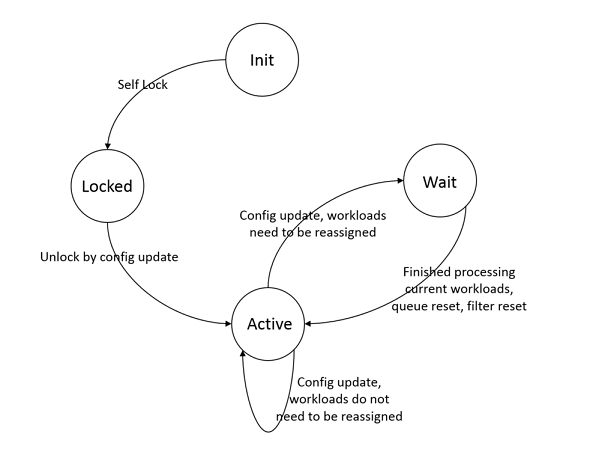
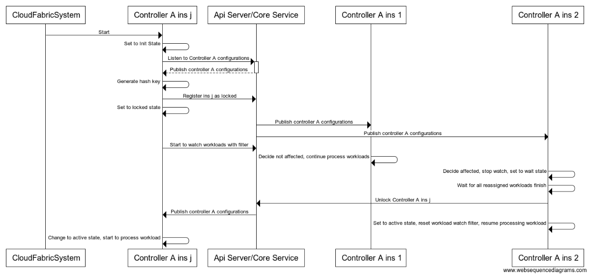
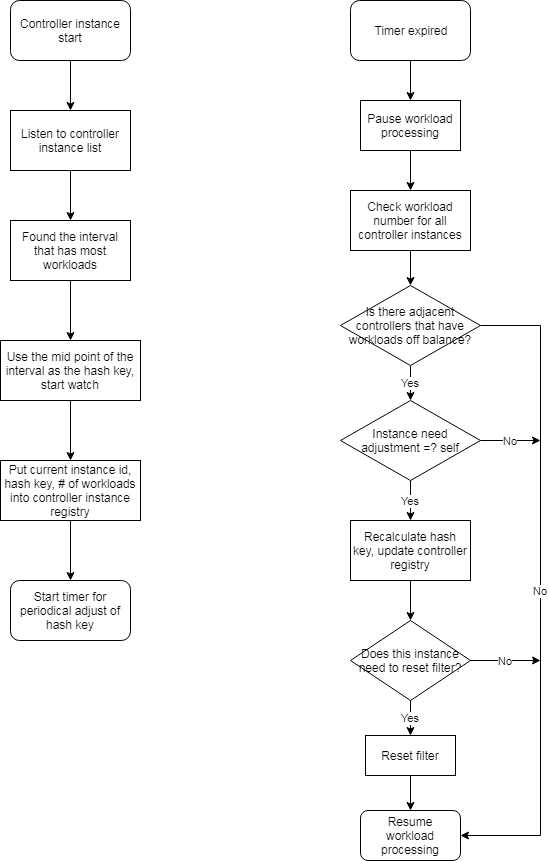

# Concepts
* Controller Manager: host of controller instances, each controller manager runs as a separate process
* Controller: each controller instance is processing the workload request and maintain system status (such as replicaset controller in k8s). A controller instance can have one to many workers running concurrently. 
* Controller worker: each controller worker get workload request from the queue, fulfill client request and maintain system status.

# Project Scope
## In Scope
* Design & implement a general controller framework that support workload request for a large scale kubernetes cluster (up to 100K nodes) - solve the scalability issue of current Kubernetes system (v1.15)
* Design & implement controller manager and controller instances deployment and scale out mechanism - facilitate controller system deployment and maintenance
* Controller system implementation rolling out plan
 
## Out of Scope
* There is no plan to fix various K8s bugs and performance issues in most of the cases except scalability issue described above
* In order to solve the controller scalability issue, this project might add some features into api server, but the scalability of api server and backend storage is not in the scope of this project. It will be handled in a separate project. 

# Design Principles
* Allow multiple instances of controllers run in parallel and split workloads
* Minimal or no increment to the api server informer watch network traffic
* Balance of workloads as much as possible but it is not the highest priority unless reached processing limit  
* All controller managers are running on the same code base and can host different types of controllers
    allow default configure and support live configuration changes
* Each controller managers can host many types of controllers
* Controller managers are not responsible for controller workload distribution

# Controller Manager
## Proposal A - fully configurable, most flexible
### Configuration

* Each controller manager instance (process) has the following fields:
    * Type: specifies the default launch configuration, including which controller it will start and how many workers the controllers will have
    * Id: instance type
* Implementation location: new data type in storage (config map is watched by all nodes. This design has health probe data and will be updated frequently. Not suitable for config map.)

### Design Details
See [ExploredSolutionsDetails-NotUsed.md](ExploredSolutionsDetails-NotUsed.md)

## Proposal B - All controller runs in each controller manager, with fixed # of workers configured
### Configuration

* All controller runs in each controller manager, with fixed # of workers configured
* When there is missing configuration for a controller, default to worker 1
* Change of configration only affects newly started controller manager, existing controller managers won't be affected
* Implementation location: config map

### Design Details
See [ExploredSolutionsDetails-NotUsed.md](ExploredSolutionsDetails-NotUsed.md)

## Proposal C - All controller runs in each controller manager, with fixed # of workers in location file configuration (or hard code)

### Configuration
* All controller runs in each controller manager, with fixed # of workers in location file configuration
* Implementation location: local configuration file

## Proposal Comparison & Decision

| Solution    | Pros           | Cons  |
| :---        | :---           | :--- |
| Proposal A  | <ul><li>Fully configurable, most flexible</li></ul> | <ul><li>Introduce new data type/key into storage.</li><li>Implementation complexity is high.</il></ul> |
| Proposal B  | <ul><li>Simple logic</li><li>One less concept - controller manager type</li><li>Some flexiblility in worker # configuration</li></ul> | <ul><li>It is confusing that how many # of controller workers are running in different controller instances.</li><li>Some memory wasting in minimal used workload requests (queue is blocked and hence workers so not too much memory waste).</li></ul> |
| Proposal C  | <ul><li>Simple logic</li><li>One less concept - controller manager type</li></ul> | <ul><li>Some memory waste but not too much</li><li>Cannot have more specific workers for increasing traffic unless start new controller manager instances</li></ul>|

* We will have use proposal C at phase I. Afterward, analyze realtime traffic and decide whether proposal A can make significant workload balance contribution. 

# Controller

## Overview
* Solution 1: supervised workload distribution
* Solution 2: unsupervised (self organized) workload distribution
    * Solution 2.a. Balanced workload distribution with increased overall network traffic
    * Solution 2.b. Unbalanced workload distribution with similar network traffic
    * Solution 2.c. Semi-balanced workload distribution with similar network traffic
* Implementation Plan
   1. Original decision is from supervised to unsupervised
   1. Decide to first spend 2 to 3 months for POC unsupervised solution. If it is not feasible, with fall back to supervised solution


## Unsupervised Workload Distribution

### Solution A - Balanced workload distribution

#### Ideas 
1. Any consistent hash function
1. Upon controller start, get full set of workloads that are not completed. (Need to check workload state support)
1. Internal records of all none completed workloads with minimized attributes: workload id, namespace/name (cache key), created timestamp, status, current assigned controller instance id 
    1. Map of workload id -> workload record
    1. Map of controller instance id -> set of workloads
1.  Upon update of instances, recaculate workload ownership; for affected workloads, reassign
    1. Need algorithm to find delta

#### Solution Overview
* Using consistent hash to distribute workload to multiple controller instances
    * Consistent hash is used to make sure workloads are evenly distributed, also minimize the impact of controller instance updates on workload redistribution
* Internal memory to cache all minimalized workloads
    * Facilitate fast workload redistribution
* Controllers are centrally registered

#### Design Details
See [ExploredSolutionsDetails-NotUsed.md](ExploredSolutionsDetails-NotUsed.md)


### Solution B - Unbalanced workload distribution
#### Ideas
1. Self maintained hash function that maps key to a limited problem space (int64)
1. Add filter by range feature into api server informer
1. Using tenant id (or tenant hash introduced in api server project) as the hash key for workload distribution
    1. Workload for a tenant can only be handled by one controller instance
    1. Natural division of workloads and related workloads, there will be no broadcasting of workloads to multiple controller instances
1. Add more controller instances for specifically for big tenants that needs half of the processing power of a controller instance  
1. Upon controller instance changes, only pause and reset filter for affected controller instance
    1. No need for central lock 

#### Problems and Analysis
1. Distribute workload based on tenant is very unbalanced, also need more controller instances if there are small intervals (# of workloads between big tenants is small)
    * Adjust hash function might be able to solve the problem but needs design for transition
1. Cannot handle big tenant once its workload reached the processing power of a single controller - scalability bottleneck
    * Need follow up design to further break down big tenant to multiple controllers
1. With the scale out of workload, filter update might have a lot of already processed workloads need to be rechecked and take a long time to start processing new workloads
    * Consider introduce additional field into workload for faster status check

### Solution C - Semi-balanced workload distribution
#### Ideas
1. Self maintained hash function that maps key to a limited problem space (int64)
1. Add filter by range feature into api server informer
1. *Using workload id as the hash key for workload distribution*
   1. Workload id is UUID, it shall have very good balanced distribution
   1. Add hash value (name as hashKey) to objectMeta, this allows hash value to be generated together with workload id
   1. Hash workload id to int64 and saved to hashKey. This will allow workload informer to filter by integer range with minimal computation 
1. *Filter dependent workloads by owner reference*
   1. Add owner hash key into OwnerReference 
1. Upon controller instance changes, only pause and reset filter for affected controller instance
   1. No need for central lock 

#### Problems and Analysis
1. How to monitor workload balance?
    * Controller instances report # of workload periodically
1. How to adjust workload balance automatically?
    * Phase I: new controller instance always pick up range that has highest workload number (only split)
    * Phase II: consolidate range that is too small and redistribute workload
1. With the scale out of workload, filter update might have a lot of already processed workloads need to be rechecked and take a long time to start processing new workloads
    * In phase I, use the original controller restart mechanism, handle this problem later when it becomes an issue
    * Consider introduce additional field into workload for faster status check

#### Solution Overview
* Add filter by range feature into api server informer
* Self defined hash function to map keys to uint64
   * As k8s framework does not handle uint64 well, use 0 - max(int64) as the range
* Each controller instance will handle a range of keys
   * For better balance, the range can be adjusted in later iteration
* Controller instances are centrally registered as a new data type
   * Config map is not a good candidate as it will be listened by all nodes
* When a new controller instance join, it will take partial workloads from the controller behind it (evaluated by controller key), the controller behind needs to reset its filter
* When a controller leave, the controller behind it will took over by resetting the filter

#### Controller Instance Registry in Storage

```yaml
Controllers:
- VirtualMachine
  - instance-id: uuidv1
    hash-key: <keyv1>
    workload-num: <numberv1>
    is-locked: boolean
  - instance-id: uuidv2
    hash-key: <keyv2>
    workload-num: <numberv2>
    is-locked: boolean
  ...
  - instance-id: uuidvm
    hash-key: <keyvm>
    workload-num: <numbervm>
    is-locked: boolean
- BareMetal
  - instance-id: uuidb1
    hash-key: <keyb1>
    workload-num: <numberb1>
    is-locked: boolean
  - instance-id: uuidb2
    hash-key: <keyb2>
    workload-num: <numberb2>
    is-locked: boolean
  ...
  - instance-id: uuidbn
    hash-key: <keybn>
    workload-num: <numberbn>
    is-locked: boolean
```

* Use etcd lease and timeout mechanism
   * When instance join, it will create a instance node with its key and attach a timeout; it also watch the Controllers/<Controller Type> node
   * All healthy instances will periodically renew the instance node with a timeout, also report # of workloads it listed
   * If a instance failed to renew, the instance node will be automatically deleted from the tree and other instances will be notified
* Hash key is used to balance the workload distribution
   * Upon initialization, controller instance will generate its hash key
* Questions
   * Why not use config map? - config map is watched by all nodes. Depend on the size of controller family, the data volume can be significant. (However, we can use config map as alternative at the beginning if cannot add new type into etcd quickly)
       

#### Change to existing api server
* Add a new data type and informer: controller instance
* Add filter by range feature into api server informer
* Add a hash value field (int64) to workload data structure - ObjectMeta (same level as workload id)
  * Hash value is calculated from workload id (or other workload field that is likely to evenly distribute).
  * Hash value will be calculated when workload is created, no update. (It is not an identifier. Can share the same value with other workloads.)
* Add an hash value field (int64) into workload owner reference data structure
  * Set owner reference hash value in controller_ref.go:NewControllerRef()

#### Controller Internal Workflow

##### Controller Instance States
* Init - initialization
* Locked - locked, waiting to be unlocked by controller registry
* Wait - waiting for workload processing to complete
* Active - processing all workloads



##### Controller Instance Initialization & Update
* Lock means pause processing workload
* When new controller instance join, there will be workload redistribution. It is ok for a controller instance to exam a processed workload. However, it may not be ok for a controller to process a workload that is still under processing. Therefore, we need a mechanism to make sure such thing won't happen.
* No need to lock all controller instances, only need to lock the one that will get instances from others (because those workloads might be in processing)



* Phase I controller hash key generation algorithm:
    * When the first controller instance start, it will take all the workloads (hash key = max int64, lower bound = 0)
    * When a new controller instance starts, it will find the first longest interval (by workload number or just key range before workload number is implemented), split it to half and take the first part:
        * Assume the longest interval is (a, b] (b is the hash key for controller instance i), the interval for the new instance will be (a, (a+b)/2], the new interval for instance i will be ((a+b)/2, b]


##### Controller Workload Periodical Adjustment



* An internal list of all controller instances (with the same type such as replicaset)
* A group of functions that watch controller instances and decide filter range for workload informers
    * Register current controller
    * Read and update controller instance records
    * Adjust filter based on new controller instance records
    * Rejoin controller list if found it was out of loop from last update
* A status attribute for workload processing control (stop processing during filter adjustment)

#### Hash Key Management
* A hash algorithm to map string to int64
    * Use golang internal hash function for now (hash/fnv)
* A script that can update hash key of controller instances - for workload processing rebalance
    * Phase I need it for rebalance manually
    * In phase II, there will be auto rebalance

#### Implementation Steps
1. Add filter by range feature into api server informer (830)
1. Add hash value field to workload data structure (830)
   1. Add hash function that map workload uuid to 0 - int64
   1. Add hash value field to workload data structure
   1. Add owner reference hash value field to workload metadata OwnerReference struct
1. Controller framework
   1. Add controller instance list (830)
   1. Add controller status (830)
   1. Interface definition for controller instance configuration: create, read, update - mock controller instance value (830)
   1. Controller instances management
      1. Add controller instance type into storage (830)
      1. Add controller instance informer (830)
      1. Add watch logic into controller framework (830)
      1. Implement new instance registration (830)
         1. Pick the range of highest workload number and split in half (830)
      1. Implement controller instance update (930)
         1. Workload distribution rebalance
1. ReplicaSet controller use controller framework
   1. Apply controller framework to replica set controller (830)
   1. Set owner reference hash value in controller_ref.go:NewControllerRef() (830)
   1. Filter replicaset and pod by range (830)
   1. Existing unit test pass (830)
   1. Use controller manager to start replicaset controller instance (830)
   1. Manual deployment (830)
   1. New unit tests (930)
   1. New end to end test (930)
1. Volume controller use controller framework (TBD)
   1. Apply controller framework to volume controller
   1. Filter volume workload by range
   1. Query other related workload in realtime (instead of from cache)
   1. Existing unit test pass
   1. Use controller manager to start volume controller instance
   1. Manual deployment
   1. New unit tests
   1. New end to end test
1. VM controller use controller framework (TBD)
1. Network controller use controller framework (TBD)
1. Service controller use controller framework (TBD)

### Proposal Comparison & Decision
| Solution    | Pros           | Cons  |
| :---        | :---           | :--- |
| Balanced workload distribution | <ul><li>Workload distribution is mostly even, can fully ultilized each controller instance processing power</li></ul>| <ul><li>Network traffic will be increased, it will be a linear function of the # of controller instances, increased burden to core/api server</li><li>Extra internal memory requirement for saving all minimized workloads.</li><li>Each workload will need to provide a way to calculate completed standard - more code changes.</li><li>Most complicated implementation logic.</li></ul> |
| Unbalanced workload distribution | <ul><li>No increment on traffic/api server burden</li><li>No extra memory requirement</li></ul> | <ul><li>Workload distribution can be very uneven.</li><li>Current design has scalability limit to biggest tenant workload size.</li><li>Hash function maintenance.</li><li>Need extra maintenance manual/script when a tenant grows too big to share controller with others.</li></ul> |
| Semi-balanced workload distribution | <ul><li>No increment on traffic/api server burden</li><li>No scalability bottleneck</li><li>Workload distribution is relatively even.</li><li>No extra memory requirement</li><li>Require least implementation.</li></ul> |  <ul><li>Not fully balanced.</li><li>Some code changes in invididual controller to minimize network traffic</li></ul> |

* We choese solution 3 - semi-balanced workload distribution for phase I. It can be converted to solution 2 if there is issue with realtime querying other data.
