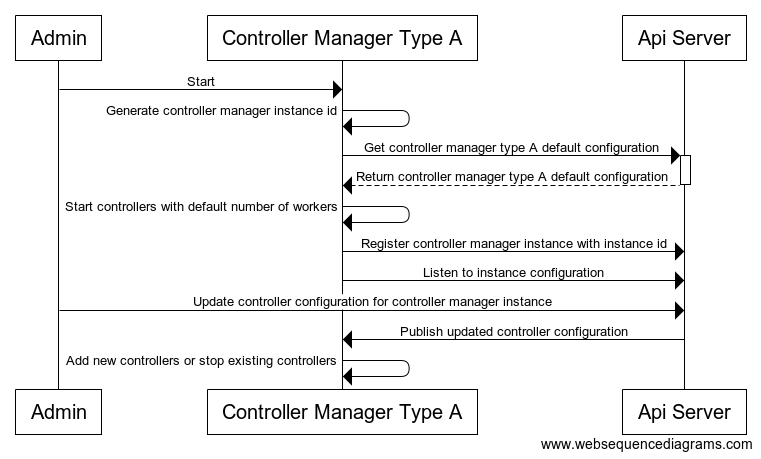
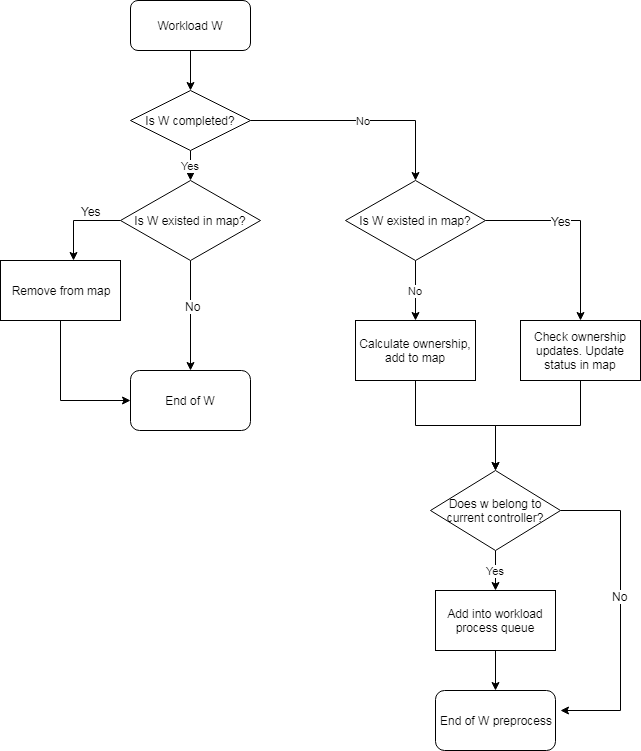
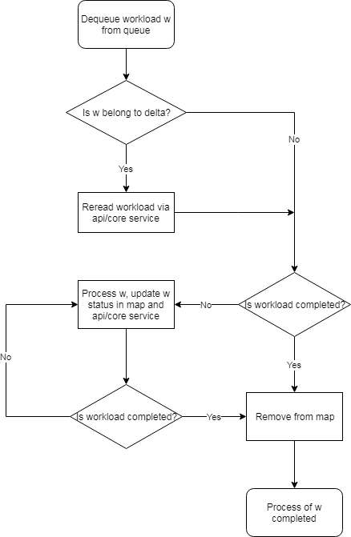
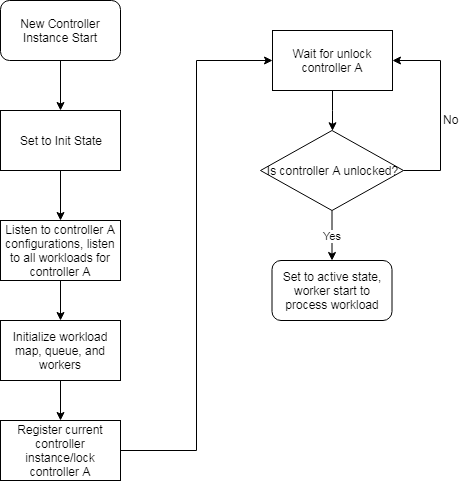
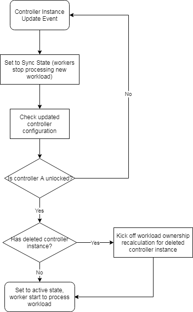
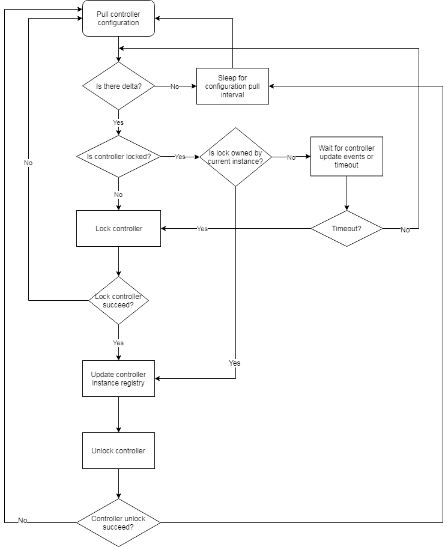

# Controller Manager
## Proposal A - fully configurable, most flexible
### Configuration

* Each controller manager instance (process) has the following fields:
    * Type: specifies the default launch configuration, including which controller it will start and how many workers the controllers will have
    * Id: instance type
* Implementation location: new data type in storage (config map is watched by all nodes. This design has health probe data and will be updated frequently. Not suitable for config map.)

```yaml
ControllerManagerDefault:
- controller-manager-type: pods
  controllers:
  - type: deployment
    workers: 5
  - type: scaleset
    workers: 10
- controller-manager-type: jobs
  controllers:
  - type: job
    workers: 5
  - type: cron-job
    workers: 5
ControllerManagerInstances:
- controller-manager-id: uuid1
  controller-manager-type: pods
  last-healthprobe-at: '2019-05-01 01:00:00'
  is-alive: true
  controllers:
  - type: deployment
    workers: 5
  - type: scaleset
    workers: 2
- controller-manager-id: uuid2
  controller-manager-type: jobs
  last-healthprobe-at: '2019-05-01 01:00:00'
  is-alive: true
  controllers:
  - type: job
    workers: 8
  - type: cron-job
    workers: 2

```

### Start & Update Workflow




## Proposal B - All controller runs in each controller manager, with fixed # of workers configured
### Configuration
* All controller runs in each controller manager, with fixed # of workers configured
* When there is missing configuration for a controller, default to worker 1
* Change of configration only affects newly started controller manager, existing controller managers won't be affected
* Implementation location: config map

```yaml
ControllerManager:
- controllers:
  - type: deployment
    workers: 5
  - type: scaleset
    workers: 10
  - type: job
    workers: 5
  - type: cron-job
    workers: 5
```

# Controller

## Unsupervised Workload Distribution

### Solution A - Balanced workload distribution

#### Ideas 
1. Any consistent hash function
1. Upon controller start, get full set of workloads that are not completed. (Need to check workload state support)
1. Internal records of all none completed workloads with minimized attributes: workload id, namespace/name (cache key), created timestamp, status, current assigned controller instance id 
    1. Map of workload id -> workload record
    1. Map of controller instance id -> set of workloads
1.  Upon update of instances, recaculate workload ownership; for affected workloads, reassign
    1. Need algorithm to find delta

#### Problems and Analysis
1. Affected workloads need to be reread for status update 
    * Unavoidable for any reassignments
1. How to avoid massive traffic and recalculation caused by workload reassignment? 
    * If controller instance updates happen frequently, there will be a lot of reassignment
    * Reread and increased traffic increment/recalculation cannot be avoid but can be distributed throughout the processing period
1. Memory usage for all workload storage
    * Minimize workload data saved in memory
    * Need to estimate and performance test for the benchmark
1. Can controller be locked for a very long time when system is not stable?
    * Lock controller means there will be no processing of new workload. It does not block new controller registration or removal. Once controller instances are stabilized, it will resume processing workloads.
    * Performance test need to simulate this scenario
1. Workloads are watched by all controller instances, network traffic and request on api/core server is multiplied
    * Minimize workload traffic by introducing minimized workload data type and watch minimized workload data type from api/core server
    * For related workload (such as pod for replicaset), filter out the ones that do not have owner references

#### Solution Overview
* Using consistent hash to distribute workload to multiple controller instances
    * Consistent hash is used to make sure workloads are evenly distributed, also minimize the impact of controller instance updates on workload redistribution
* Internal memory to cache all minimalized workloads
    * Facilitate fast workload redistribution
* Controllers are centrally registered
    
#### Controller Instance Registry in Storage

* A. Add the entire data controller instance structure into storage
    * A shared controller lock for add/remove controller instances
    * Lock is only for controller instances adjustment, not for workload distribution or redistribution
    
```yaml
Controllers:
- controller-type: VirtualMachine
  locked: false
  instances:
  - instance-id: uuid1
    last-healthprobe-at: '2019-05-01 01:00:00'
  - instance-id: uuid2
    last-healthprobe-at: '2019-05-01 01:00:00'
  - instance-id: uuid5
    last-healthprobe-at: '2019-05-01 01:00:00'
- controller-type: BareMetal
  locked: true
  instances:
  - instance-id: uuid3
    last-healthprobe-at: '2019-05-01 01:00:00'
  - instance-id: uuid4
    last-healthprobe-at: '2019-05-01 01:00:00'
```

* B. Use etcd lease and timeout mechanism
    * When a new controller starts or rejoin the network, it will renew its key with storage and attach a timeout
    * If a controller is in the list, it is alive; otherwise, it is out of the loop

```yaml
Controllers:
- VirtualMachine
  - <instance-id-v1>
  - <instance-id-v2>
  ...
  - <instance-id-vm>
- BareMetal
  - <instance-id-b1>
  - <instance-id-b2>
  ...
  - <instance-id-bn>
```

| Solution    | Pros           | Cons  |
| :---        | :---           | :--- |
| A | <ul><li>Platform independent</li></ul> | <ul><li>Design and implementation of locking mechanism is much more complicated than B.</li></ul> |
| B | <ul><li>Simple</li></ul> | <ul><li>Tightly coupled with storage</li></ul> |

* Suggestion: phase I take solution B. Migrate to solution A if migration is necessary.

#### Controller Internal Data Structure
* Workload data structure
   * Workload id, name, namespace, controller instance id, created timestamp, status, optional workload details
   * Memory usage estimation:
       * 8 (uuid) + 20 (name) + 20 (namespace) + 8 (uuid) + 24 timestamp + 100 (status) = 180 bytes
       * 1M bytes ~= 5K workloads, 0.3M workloads ~= 60M bytes memory usage (ok)  
* Map of controller instance id to set of workload ids
   * Use for distributed workload ownership calculation
* Map of workload id to workload

#### Controller Internal Workflow
##### Preprocess of Workflow - single controller


##### Process of Workflow - single controller


##### Controller Instance CUD
Controller Instance Initialization, Update/Delete

 

Controller Instance Synchronization



#### Algorithm
. Consistent hashing algorithm: [https://raw.githubusercontent.com/stathat/consistent/master/consistent.go](https://raw.githubusercontent.com/stathat/consistent/master/consistent.go)
