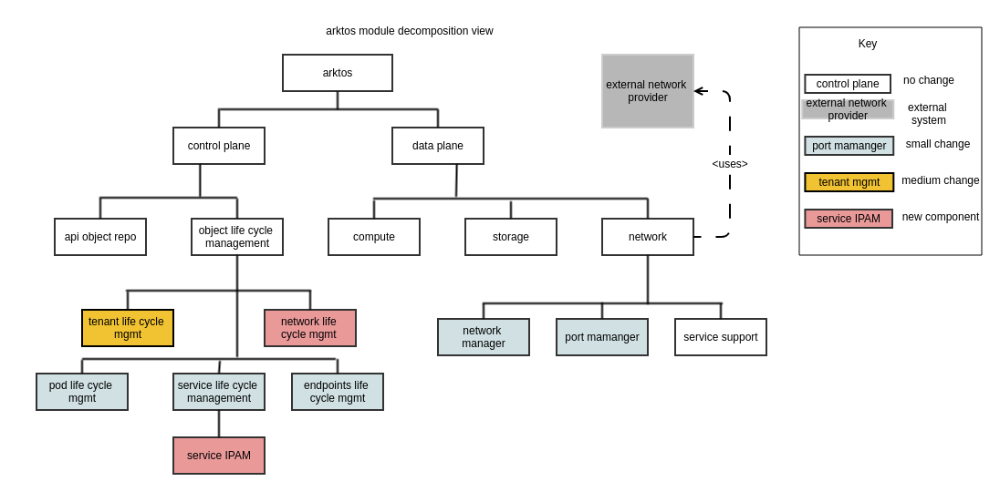
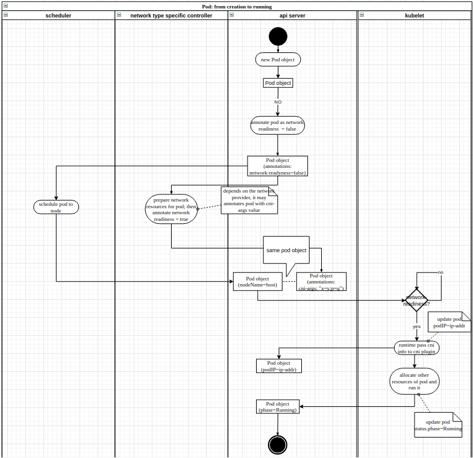

# Multi-Tenancy Network

Xiaoning Ding, Hong Chen

## Introduction

This document is a part of the multi-tenancy design documents in Arktos. It describes network-related design changes to support multi-tenancy, including network model, backward-compatibility, DNS and service changes, etc.

Please refer to other design documents in the "multi-tenancy" document directory if you want to learn about other parts in the multi-tenancy design.


## Network Isolation

following resources are network related, which need to be isolated inside network boundary:

* Pod (with regarding to IP address & connectivity)
* Service (including DNS service, and kubernetes service)
* Endpoints / EndpointSlice
* Ingress / egress
* Network Policy

See below illustrative diagram for isolation across networks:


Network isolation is achieved with a new API object: network:

* Every pod is associated with a certain network object. If not specified it will be associated to a default network object, which is created when a space is initialized. 
* A pod can only communicate with pods within the same network.
* Every network has its own DNS service. An associated DNS service is automatically created when a new network object is created. (**tbd: decide when to deploy the actual DNS server pods**)
* As a general rule, all network related resources are associated with the network object, and semantically residing within the network scope. 

Pods in a network __should__ be able to access API server nodes by their IP addresses - this is required for access to kubernetes service. Network providers need to satisfy this prerequisite.

(**TBD: is it possible to leverage the fact that pods are running on hosts which are already on the node network(e.g. pod being dual-homed with one nic dedicated for node network access)?**)

### Network Object

A network object contains its type and type-specific configurations. It is not a namespace-scoped object, one network object can be shared by applications spanning multiple namespaces within a space.

It is defined using CRD by [crd-network.yaml](../../../pkg/controller/artifacts/crd-network.yaml)

The "type" field is the only mandatory field in a network object. It indicates network provider that allocates & manages the network resources. In particular, _flat_ type is reserved for canonical k8s flat networking model where various community cni plugins can be used as the underlying network provider.

A command-line parameter named "default-network-template-path" of tenant controller will decide which default network will be created for a new space.

For flat network env, each space should still have its own default network, as kube-dns service is isolated across tenants.

The content of default network template file should reflect the Network object in json format, with ```{{.}}``` the replacement of tenant name, like
```json
{
    "metadata": {
        "name": "default",
        "finalizers": ["arktos.futurewei.com/network"]
    },
    "spec": {
        "type": "vpc",
        "vpcID": "{{.}}-default-network"
    }
}
```

Below is the definition of a flat network:

```yaml
apiVersion: arktos.futurewei.com/v1
kind: Network
metadata:
  name: default
spec:
  type: flat
```

And here is a sample of a VPC network:

```yaml
apiVersion: arktos.futurewei.com/v1
kind: Network
metadata:
  name: vpc-1
spec:
  type: vpc
  vpcID: vpc-1a2b3c4d
```
When a pod is attached to the default network, nothing is needed in pod spec:

```yaml
apiVersion: v1
kind: Pod
metadata:
  name: nginx
spec:
  containers:
  - name: nginx
    image: nginx
```
When a pod is attached to a certain network, it needs to set its "network" using labels:

```yaml
apiVersion: v1
kind: Pod
metadata:
  name: nginx
  labels:
    arktos.futurewei.com/network: vpc-1
spec:
  containers:
  - name: nginx
    image: nginx
```


When a pod is attached to a certain network and it wants to specify subnet or IP, it can be expressed using annotations:

```yaml
apiVersion: v1
kind: Pod
metadata:
  name: nginx
  labels:
    arktos.futurewei.com/network: vpc-1
  annotations:
    arktos.futurewei.com/nic: {"name": "eth0", "ip": "192.168.0.12"}
spec:
  containers:
  - name: nginx
    image: nginx
```

Here annotation arktos.futurewei.com/nic is for user to provide optional information about pod nic. The recognized keys of element include:

|key|exemplary value|
|---:|---:|
|name|eth0|
|subnet|subnet-1, or 192.168.100.0/26|
|ip|192.168.100.5|

If these settings are set on a pod attached to a flat network, the settings will be ignored by the flat network controller and also the corresponding CNI plugins, as the existing cni plugins used in flat network have no support for such extension yet.

(**TBD: for a flat network, can we automatically limit its communication scope to that network?**)

(**TBD: do we plan to support multiple network providers? How would it impact the type definition?**)

#### Network Status
The network resource could have status.phase explicitly indicating its current phase in the whole life cycle. Arktos network controller is responsible to update this field, based on appropriate conditions.

|status.phase|explanation|
|---:|:---|
|Pending|network is created; waiting for external network provider to finish provisioning|
|Failed|network is in faulty state|
|Unknown|network is in unknown state|
|Ready|network is well provisioned and can be used to serve workloads. For external IPAM typed networks, it checks for presence of DNS service IP assignment (status.dnsServiceIP) as the signal of provision success|
|Terminating|network is being decommissioned, waiting for resource cleanup|

After all the associated resources have been cleaned up, the terminating network would be physically purged from API server.

Arktos network controller registers the finalizer "arktos.futurewei.com/network" for ready network objects.

### Network Controller

A network controller watches its interesting network objects based on network type.

A flat network controller only initializes the DNS service and deployment for a new network, and also deletes them when a network object is removed. It doesn't do anything else.

A VPC network controller will call VPC service provider to allocate ports for newly created pods and deallocate ports when pods are deleted, in addition to the DNS service initialization and removal that's done in flat network controller. 

### DNS

Each network has its own DNS service, which only contains the DNS entries of pods in that that network, regardless of network type. 

The reasons that DNS service is per-network instead of per-space are:

* For VPC networks IPs could be overlapped. A pod with resolved IP 192.168.0.1 could be in different networks. Therefore it's useless for the DNS clients.
* VPC networks are isolated by nature. It will be difficult to have a shared DNS pod that's accessible to pods in various VPC networks.

(**TBD: is it possible to have _shared_ DNS able to serve multiple network?**)

### Service

#### Type definition

Service objects associate to network via label arktos.futurewei.com/network. By default, "network" is the default network of the tenant.

```yaml
apiVersion: v1
kind: Service
metadata:
  name: my-service
  labels:
    arktos.futurewei.com/network: my-network
spec:
  selector:
    app: MyApp
  ports:
    - protocol: TCP
      port: 80
      targetPort: 9376
```

#### Naming Problem & Solution

Services, as one of the critical network related resource types, are within the network boundary. There is no cluster wide shared services for a tenant, as both the virtual IP address and the associated endpoints are all scoped within a single network.

Putting service type in tenant level is out of primacy as it has following flaws:
1. service IP address has to be the same across all networks, which implies some range of service IP needs to be predefined as shared across networks of a tenant (tenant manageability burden);  
1. associating network-agnostic service to network-specific endpoints would introduce significant inconsistency;
1. kubectl query for service (e.g. ```kubectl describe service```) has no way to return meaningful content of endpoints.

The well-known services (default/kubernetes, kube-system/kube-dns) present some problem here. Service kubernetes has tenant/namespace(default) scope in current implementation, unable to have multiple kubernets services with each of them in one network due to name conflict. The same rational applies to kube-dns.
docs/design-proposals/multi-tenancy/images/network-resource-isolation.png
One solution is to making its name colliding space to tenant+namespace+network, which is also breaking and inconsistent with other types (e.g. introducing network as one more parameter to call kubectl get service).

Another solution is to change their name to schema that can uniquely differentiate by combining with network name; this is awkward and breaking in general. 

One plausible remedy is making stringent containment of network to namespaces - resources in one namespace belongs solely to one network; one network can accommodate multiple namespace. This cannot handle the default/kubernetes service problem, as it is of default namespace.

None of the two of above seems ideal. However, the latter, fiddling with the service name, if coupled with trick applicable only to kubernetes & kube-dns, seems pragmatic and practical. The idea is suffixing service name with network name (e.g. kubernetes_mynetwork), also answering query for kubernetes with that of kubernetes_mynetwork (by alias record or other form of dynamic technique), so that pods are able to look up them without using the network-suffixed names. This approach is not flexible and depending on dns ability; it works fine with limited number of well-known aliases, though. coreDNS, one of the most commonly used dns server binaries, has such dynamic aliasing ability.

One of the confusions is ```kubectl get service kubenetes``` would fail with no such resource error - this is breaking, but for good reason - to remind users of service resource being network specific in our system. However, pods are able to query DNS for kubernetes without caring about the new name schema as they are network related and able to locate the proper DNS service in the interesting network scope.

#### Service IP

Service IP address is allocated from the network-specific pool. 

These are two types of service IP pool:

##### Arktos managed pool
Service IP addresses are explicitly managed by Arktos for every network. Each network might have different range of service IPs.

Service IPAM is provided through 2 changes:

1. each network object specifies its service IP range;

    ```yaml
    apiVersion: v1
    kind: Network
    metadata:
      name: default
    spec:
      type: flat
      service:
        cidrs:
        - 10.0.0.0/16
        - 192.168.0.0/24
    ```
   
1. on service creation, the current service IP address assignment mechanism is used - in scope of individual network instead of the whole cluster, though.

##### Network provider managed pool
Service IP addresses are implicitly managed by the capable network provider. Network object can have the service IP cidr (or not); at best for information - Arktos delegates IPAM to the external network provider, via network/service controller (detailed design TBD) interacting with the external network provider.

(**TBD: Can we support network provider to mutate service IP after it has been assigned? If so, how does the mutation propagate to Arktos?**)

Network object specifies service IPAM as *external*:

    apiVersion: v1
    kind: Network
    metadata:
      name: default
    spec:
      type: mizar
      service:
        ipam: External

(**TBD: consider support for user can provide hints about service IP address**)

#### Semantic support

For flat typed networks, regular kube-proxy may be used to provide pod access to service.

For VPC-isolated networking, service IP support has to be provided w/o relying on iptable/IPVS rules on host netns. In other words, traditional kube-proxy can not used in VPC-isolated networking. A dedicated controller may be employed to establish & maintain service IP/pod IP mappings.
(**TBD: more details required**)

### Endpoints
Each endpoints object associates with a network, the same as its service.

For the services of _kubernetes_ and _kube-dns_ (in fact they are kubernetes-{network} and kube-dns-{network}), there are two special set of endpoints objects:

* kubernetes related EPs

They are in default namespace, named as kubernetes-{network}, for the kubernetes service of the network.

Query for default-ns scoped kubernetes-{network} shall get back the proper content based on the cluster kubernetes endpoints object. System does not duplicate such endpoints; instead it derives content based on the cluster kubernetes endpoints. This would incurs quite some code change to kube-apiserver.

For now, get verb with this kind of EP is supported; however, list/watch verb won't include per-network kubernetes EP. For a controller that needs to use these EPs, one workaround is deriving from the cluster scoped EP, besides using get verb in this special case.

Updates originated from regular tenants are disallowed.

Alternative is to duplicate in every network, when network is being provisioned. It is burdensome to keep all synced to the root one (which is maintained by api-server). 

(**TBD: consider to implement list/watch verb with per-network kubernetes EPs**)

* kube-dns related EPs

They are in kube-system namespace, named as kube-dns-{network}, for the kube-dns service of the network.

kube-dns-{network} shall be managed by Endpoints controller just like a regular endpoints.

__EndpointSlices__, the new type introduced in k8s v1.17, is out of current scope.

### Network Policy

Network policies are used to depict the desired network security within Arktos. Without any network policy in place, Arktos allows any pod to access other pods, across all tenants and namespaces for a flat typed network environment. VPC typed network environment, on the other hand, does provide strong tenant level network security even in the absence of any network policy in place.

Without any syntax change, Existing k8s network policy specifications provide support for enforcing tenant scoped network security. Allowing access across tenant boundary is currently not supported within Arktos.

Network-isolation mode makes more sense in most cases. Below is an example for specific network, my-network, in one namespace. Similar network policies need to apply to other namespaces, too.
```yaml
---
apiVersion: networking.k8s.io/v1
kind: NetworkPolicy
metadata:
  name: default-deny-all
  namesapce: bar
spec:
  podSelector: {}
  policyTypes:
  - Ingress
  - Egress
---
apiVersion: networking.k8s.io/v1
kind: NetworkPolicy
metadata:
  name: network-isolated-policy-for-my-network
  namesapce: bar
spec:
  podSelector:
    matchLabels:
      arktos.futurewei.com/network: my-network
  policyTypes:
  - Ingress
  - Egress
  ingress:
  - from:
    - namespaceSelector: {}
    - podSelector:
        matchLabels:
          arktos.futurewei.com/network: my-network
  egress:
  - to:
    - namespaceSelector: {}
    - podSelector:
        matchLabels:
          arktos.futurewei.com/network: my-network
```

For the default network, isolation can be achieved by:
```yaml
---
apiVersion: networking.k8s.io/v1
kind: NetworkPolicy
metadata:
  name: default-deny-all
  namesapce: bar
spec:
  podSelector: {}
  policyTypes:
  - Ingress
  - Egress
---
apiVersion: networking.k8s.io/v1
kind: NetworkPolicy
metadata:
  name: implicit-default-network-isolated-policy
  namesapce: bar
spec:
  podSelector:
    matchExpressions:
    - key: arktos.futurewei.com/network
      operator: DoesNotExist
  policyTypes:
  - Ingress
  - Egress
  ingress:
  - from:
    - namespaceSelector: {}
    - podSelector:
        matchLabels:
          arktos.futurewei.com/network: default
  - from:
    - namespaceSelector: {}
    - podSelector:
        matchExpressions:
        - key: arktos.futurewei.com/network
        operator: DoesNotExist
  egress:
  - to:
    - namespaceSelector: {}
    - podSelector:
        matchLabels:
          arktos.futurewei.com/network: my-network
  - to:
    - namespaceSelector: {}
    - podSelector:
        matchExpressions:
        - key: arktos.futurewei.com/network
        operator: DoesNotExist
---
apiVersion: networking.k8s.io/v1
kind: NetworkPolicy
metadata:
  name: explcit-default-network-isolated-policy
  namesapce: bar
spec:
  podSelector:
    matchLabels:
      arktos.futurewei.com/network: default
  policyTypes:
  - Ingress
  - Egress
  ingress:
  - from:
    - namespaceSelector: {}
    - podSelector:
        matchLabels:
          arktos.futurewei.com/network: default
  - from:
    - namespaceSelector: {}
    - podSelector:
        matchExpressions:
        - key: arktos.futurewei.com/network
        operator: DoesNotExist
  egress:
  - to:
    - namespaceSelector: {}
    - podSelector:
        matchLabels:
          arktos.futurewei.com/network: my-network
  - to:
    - namespaceSelector: {}
    - podSelector:
        matchExpressions:
        - key: arktos.futurewei.com/network
        operator: DoesNotExist
```

Of course, network policies can be specified for finer-grained network security inside network scope.

(**TBD: consider automatic creation of network policies to ease management**)

(**TBD: consider support of across-tenant network connectivity**)

#### K8S network policy enforcement

K8S community provides support for various plugins which enforce the network policies (such as Calico, Cilium, kube-router, etc.). Out of the box, these would not work within multi-tenant Arktos environment. For example, Calico may wrongly get entries from backend storage based on namespace + pod + interface name. Some of them may work within multi-tenant Arkstos environment if the controller deployed is in the form of a daemonset for each tenant. Kube-router seems very promising, we will evaluate Kube-router once Arktos fully functional multi-tenant environment is in place.

### Ingress/egress
(**TBD: more details required**)

## CNI spec
CNI_ARGS is leveraged for Arktos workload runtime to pass information on to the cni plugin of the network type.

According to the spec, the value of CNI_ARGS env var is alphanumeric key-value pairs separated by semicolons, e.g. "IPV4=12.34.56.78;VPCID=mizar-12345".

Arktos workload runtime will put whatever is the pod annotation of "arktos.futurewei.com/cni-args" to CNI_ARGS as defined in cni spec.

The network controller of the vpc network type is typically responsible for annotating pods properly with the relevant information.

## Architectural Views

Components not decided yet in the current phase are not included as part of the overall architecture views.

### Data model


### Module Decomposition



### Runtime component relationship


### Key Scenario: Tenant & DNS provisioning


### Activity Flow: Pod Creation to Running status



1. On pod creation, using a custom admission control, annotate new pod with arktos.futurewei.com/network-readiness=false as hint for the scheduler. For flat network type, such annotation is not required as its operator typically has no network preparation work to do.
2. It is the network controller's responsibility to do whatever network resource preparation for the pod. If pod has hint of arktos.futurewei.com/nic annoation, it should honor that.
3. If applicable network resource preparation completes successfully, it is the network controller's responsibility to clean up the annotation arktos.futurewei.com/network-readiness=false afterwards in case it is present.
4. It is the network controller's responsibility to annotate pod with proper information that the cni plugin needs in term of CNI-ARGS. Arktos system just picks up the annotation value and passes it on when calling cni plugin.
