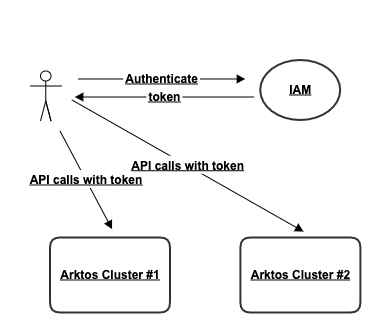
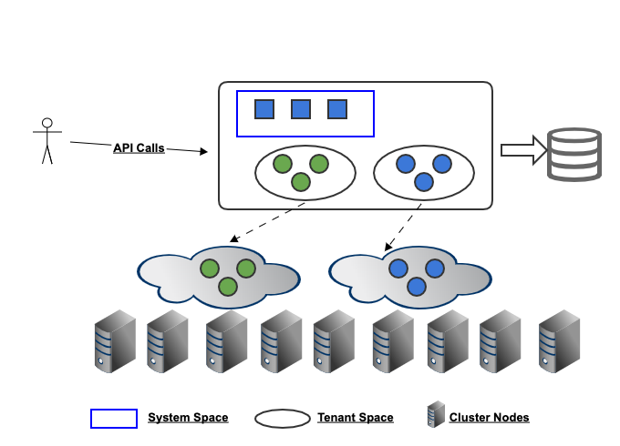

# Arktos Multi-Tenancy Overview

Xiaoning Ding, Qian Chen, Peng Du, Hong Chen

## Introduction

This document gives an overview of the multi-tenancy design in Arktos, including its motivation, requirements, design overview and lists of components changes and execution plans. For the detailed design of each part, please refer to the other documents in the same document directory.

## Motivation

Kubernetes provides a solution for automating deployment, scaling, and operations of application containers across clusters of hosts. However, it does not support multi-tenancy. There is no explicit “tenant” concept in the system, and there is no resource isolation, usage isolation or performance isolation for different tenants.

Arktos is evolved from Kubernetes. The motivation of Arktos multi-tenancy is to enable multiple organizations or teams to safely share a physical Arktos cluster, where there could be no trust among these organizations or teams. 

The targeted scenarios include:

* Provide an Arktos service to public cloud users.
* Share a same Arktos cluster in private cloud, among organizations or teams that require strong isolation.

## Requirements

There are several different multi-tenancy models. Kubernetes community has [some documents](https://docs.google.com/document/d/15w1_fesSUZHv-vwjiYa9vN_uyc--PySRoLKTuDhimjc/edit#heading=h.3dawx97e3hz6) to compare these models. In general, they can be categorized as “soft” models or “hard” models. Soft models are for scenarios of private cloud or within an organization, where there is a certain level of trust between different tenants. While hard model is for situations where there is no trust among tenants and hard model provides strong isolation.

Since Arktos aims to support the scenarios of no tenant trust, Arktos multi-tenancy is a hard multi-tenancy model. Meanwhile, flexible cross-tenant access may be also needed. A typical scenario is that team A allows team B to access its certain resources, but not all other teams.

The following functionality requirements are derived from the above discussion:

* **Isolation**: by default tenants should be strongly isolated from each other. They are not aware of the existence of other tenants at all. One tenant cannot access another tenant's resources or impact other tenants' performance. However, cross-tenant access is allowed if tenant admins set custom authorization policies.
* **Autonomy**: tenant admins should be able to perform management work within their own tenant without turning to cluster admins. Such work includes managing quota/roles/clusterRoles/service accounts and so on inside their own tenant. 
* **Manageability**: cluster operators should be able to manage tenants in an easy way and be able to enforce some common policies across all tenants.
* **Compatibility**: API compatibility should be kept as much as possible, so that existing tools can continue to run.

## Design Overview

Below is a top view of how Arktos works in a cloud environment:

The IAM service in the diagram can be any IAM service that supports a basic "tenant-user" model, where the authentication result includes a user name and the tenant name that the user belongs to. Optionally, the IAM service can provide additional properties like roles or projects.

If we drill down into an Arktos cluster, it looks like this:

A cluster is divided into control plane and data plane:

 * On control plane side, Arktos manage isolate API resources from different tenants, and also isolate them from system API resources. Within each tenant scope, tenant admins can manage these API resources in an autonomous way.
*  On data plane side, Arktos limits access within tenant scopes. For example, pod A from tenant A won't be able to access pod B from tenant B, even if tenant A users get the namespace, name or IP of pod B by guessing.

Arktos achieves these based on a new concept "space". By default a tenant is allocated a space with the same tenant name, and only that tenant and system tenant has access to the space. All API object visibility and interactions are restricted to the space.

By retrieving tenant credential from API request and automatically filling in the space information, we make spaces transparent to users. A tenant user accesses resources in its own space just like how he or she access Arktos without multi-tenancy. The APIs and tools are still compatible.

## List of Component Changes

### API Server

* Add an additional layer in API resource url: "/tenants/{tenant}/resources"
* Support short path for tenant space resources in endpoint handler.
* Add a new API object "tenant" in system space.
* Add a new API object "network" which can be in any space.
* Admission controller to block certain tenant resources: node, daemonSet.
* Admission controller: support space-level quota. 
* Add tenantName in ObjectMeta type.
* Modify bearer authenticator to extract tenant information.
* Modify RBAC authorizer to check cross-tenant access, and skip clusterRoles not in the tenant scope.
* API Discovery: return different resource G/V/K for different tenants as they may have installed different CRDs.
* API Discovery: do not return prohibited resources like nodes or daemonSets for non-system tenants.
* API Access: validate if the specified resources G/V/K is available a given tenant.

### Scheduler
* Use tenant.ALL to list/watch all resources.
* Use tenant-specific path to update a specific resource.
* (P2) Scheduling fairness: to avoid one tenant starve all other tenants.

### Controllers
* A new tenant controller to watch tenant objects, and perform initialization and cleanup work.
* For all controllers: use tenant.ALL to list/watch all resources.
* For all controllers: compare tenancy when do resource correlation.
* For all controllers: use tenant-specific path to update a specific resource.
* (P2) For all controllers: tenancy fairness.
* A new flat network controller.
* Modify the current network controller to VPC network controller.

### Kubelet
* Support Kata to provide container runtime isolation.
* Set pod DNS based on the network the pod is attached to. 

### Kube-proxy
* Replaced by VPC LBs. (**TBD: require more details**)

### Kubectl
* Support CRUDW of the new API resource: api/v1/tenants.

For existing resources, whether they are in system space or tenant spaces, client-go will read the target space information from kube-config file and transparently put it into URL path. So far no changes related to this are foreseen in Kubectl. 

### Client-go

* Support the tenant parameter for API calls: tenant.XXX, tenant.ALL.
* Parse the target space from Kube-config file and uses it in all API calls if a space is not explicitly specified as API parameters.

## Execution Plan

A complete multi-tenancy support requires a lot of work. Starting from the basics, we plan to divide the work into different milestones and steps.  

### Milestone I: Basic Multi-Tenancy

This milestone can be further split several phases. 

**Step I: API Server Changes**
  
*     Define the new resource type of Tenant and expose this resource in APIServer.
*     Add the Tenant info to the ObjectMeta of resources.
*     Update the key path of the resources in etcd to include tenant info. 
*     Generate self-links with tenant info included.
*     Install new multi-tenancy aware APIs.
*     Tenant resource url resolution and access control.
    

**Step II: Client-Go Changes**

   This phase will Update client-go code generators to support multi-tenancy.  The new generators should add the field of tenant in the resource objects, send out multi-tenancy-aware API requests to API server, and make use of the tenant info in the response correctly. 
    
   The changes will be done to the following generator:
   
*       client-gen
*       lister-gen
*       informer-gen 

**Step III: Changes in Other Related Components**  

   1.	Multi-tenancy aware kubectl. The kubectl will be
      *	Able to create/delete/update tenants.
      *	Support operation targeted at a specific tenant or across multiple tenants.
      
   2.	Update other control plane components the control plane code for make the control plane work with multiple tenants. These components include but not limited to:
      * controller
      * scheduler
      * kubelet
      
   3. Add a new controller to monitor the lifecycle of tenants. 

### Phase 2: Performance and Usage Isolation ###

*     Tenant-level Resource quota support.
*     Tenant-level rate limiting
*     Tenant-level usage metrics/statistics
