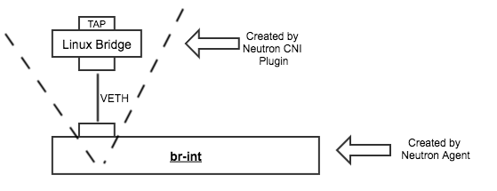

# NIC and VPC Support in Alkaid

Xiaoning Ding, Hongwei Chen

This document describes the Network Interface Card (NIC) and Virtual Private Cloud (VPC) support in Alkaid, including motivation, related pod spec changes and component changes.

## Motivation

Alkaid is evolved from Kubernetes with the goal to support VM and container workloads in an unified way. And it's designed for public cloud only. These differences bring two new networking requirements:

* In Kubernetes a pod doesn't need to specify its NIC or IP configuration. It relies on the underlying container networking provider to create NICs and assign IPs, usually through an IPAM plugin. This is suitable for container applications. However, for VM applications it's common to specify NIC configurations, especially for some legacy VM applications.

* Kubernetes can run with different networking solutions for different scenarios. But Alkaid is designed for public cloud only. Therefore, it's important to provide a native support for VPC networking in public cloud.

The rest of the document explains how Alkaid supports NIC configurations on a pod, and how it integrates with VPC services.


## VPC Integration Overview

As an internal cluster management system in cloud data centers, Alkaid itself doesn't expose APIs to cloud users directly. Cloud users interact with public cloud services that are built on top of Alkaid, such as ECS or CCI services. These services then in turn call Alkaid APIs to manage workload lifecycles.

An Alkaid pod has one or more **NICs**. Each Nic is mapped to a **port** resource that is backed by a cloud VPC service. 

A port is always attached to a certain subnet in a certain VPC, and may belong to one or more security groups. In fact, there are many different types of VPC resources, such as routing rules, gateways, etc. Alkaid is not responsible for creating these VPC resources. These VPC resources are created:

* by cloud users directly calling VPC service APIs;
* or by a cloud service such as ECS calling VPC service APIs.

The only VPC resource type that Alkaid manages is port. Alkaid calls VPC service APIs to create, update and delete port resources that are associated with each pod.

The below diagram shows the relationship among these services:


Alkaid supports different VPC services as long as they provide the port abstraction. For now we support two different implementation of VPC services:

* OpenStack Neutron
* Alkaid Networking (Alioth)

Alkaid leverages CNI plugin mechanism to support these different VPC services. A CNI plugin mainly does two things:

* Talk to the corresponding  VPC service API to create, update and delete ports.
* Attach and detach the port into the corresponding  data plane components on local host, such as the Neutron OVS bridge or Alioth eBPF filters.

The below diagram gives an illustration.


## Pod Spec Changes

Pod spec is extended to include two fields:

* VPC field. For now, one pod only belongs to one VPC no matter how many NICs the pod has.
* NICs field. This is a list of NICs that belong to this pod. If no NIC is specified a default NIC will be added. The maximum allowed NIC number is determined by the VM flavor. For containers it will be determined by cluster configuration. 

NICs defined on a pod are shared by all containers inside the pod, or the single VM in the pod. 

Here are some sample pod YAML files to give an 

pod1.yaml: a container pod with one default NIC. 

```yaml
apiVersion: v1
kind: Pod
metadata:
  name: nginx
spec:
  containers:
  - name: nginx
    image: nginx
    ports:
      - containerPort: 443
  vpc: vpc-1a2b3c4d
```

pod2.yaml: a container pod with one single NIC. 

```yaml
apiVersion: v1
kind: Pod
metadata:
  name: nginx
spec:
  containers:
  - name: nginx
    image: nginx
    ports:
      - containerPort: 443
  vpc: vpc-1a2b3c4d
  nics:
    - subnet: subnet-1
```

pod3.yaml: a container pod with one single NIC, which has a specified IP. If the specified IP is not available in the specified subnet, an error will be raised.

```yaml
apiVersion: v1
kind: Pod
metadata:
  name: nginx
spec:
  containers:
  - name: nginx
    image: nginx
    ports:
      - containerPort: 443
  vpc: vpc-1a2b3c4d
  nics:
    - subnet: subnet-1
      ip: 192.168.0.12
```

pod4.yaml: a VM pod with one single NIC, which has a pre-created port object.

```yaml
apiVersion: v1
kind: Pod
metadata:
  name: nginx
spec:
  VMs:
  - name: nginx
    image: www.foo.com/vmimages/nginx
    flavor: m1.large
    ports:
      - VMPort: 443
  vpc: vpc-1a2b3c4d
  nics:
    - portID: a2815656-76f7-46d4-9d11-057063db1a14
```
pod5.yaml: a VM pod with two NICs, one specified IP and security group, and one has a pre-created port object.

```yaml
apiVersion: v1
kind: Pod
metadata:
  name: nginx
spec:
  VMs:
  - name: nginx
    image: www.foo.com/vmimages/nginx
    flavor: m1.large
    ports:
      - VMPort: 443
  vpc: vpc-1a2b3c4d
  nics:
      - subnet: subnet-1
        ip: 192.168.0.12
        securityGroup: aa5db150-a63d-4bd1-8d70-2dff67c6a5d9
      - portID: a2815656-76f7-46d4-9d11-057063db1a14
```

A NIC can also have a name. If not specified it will be named "eth0", "eth1", ... and so on.

## Flows

This section describes the end-to-end flow for the pod creation, as it's the most complicated one involving almost all computing and networking components.

### Integration With Neutron

The below sequence diagram shows the flow with the example of a VM pod and the Neutron VPC service.


Flow explanations:

* First, scheduler, network controller and node agent establish the pod watch on the API Server.
* User submits a VM pod with NIC configurations.
* Both scheduler and network controller will get the new pod event. They work in parallel:
  * Scheduler will find a node to run the pod and update the nodeName field.
  * Network controller will inspect the NIC section in pod spec. If any NIC doesn't have a portID there, it means the port hasn't been created. It will call Neutron service API to create the port, and update the port ID in pod status.
* Node agent will receive the pod event after the NodeName field is updated by scheduler. It checks PodStatus to ensure all NICs have port ID ready, and then call the VM runtime to create the VM.
* VM runtime calls CNI plugin to prepare NICs.
* The Neutron CNI plugin will call Neutron API to bind the port object. Basically, this is to tell Neutron that the port will be placed on current host.
* The Neutron CNI plugin then creates per-port items: a tap, a Linux bridge and a veth pair. These items will follow the naming convention based on port ID. And they will be attached to the br-int OVS bridge created by Neutron agent.
* After the Neutron agent detects that the veth has been attached to the br-int bridge, it will get the flow table changes from the Neutron server and then programmed these rules into its OVS bridges.
* After the Neutron CNI plugin receives the Neutron notification that all flow update is done, it returns and the TAP device is ready for a VM to use.
* The VM runtime performs some necessary wiring work to connect the TAP device to the QEMU VM.

### Integration with Alioth

Here is the sequence flow in the case of Alioth VPC service:


As you can see most parts of the flow are same, including pod watching, calling VPC API, etc. The difference is mainly about how Alioth update ports and how Alioth CNI plugin works:

* Alioth control plane will update transit switches to ensure packets are correctly forwarded, and also notify host agent to create a new endpoint.
* Alioth CNI Agent doesn't create tap, linur bridge or veth devices which are required in the Neutron case. Alioth CNI plugin only waits until a virtual network interface with a given name to appear.

The section of Alioth CNI plugin also describes the interaction.

## Code Changes


### API Server

The following code changes are required in API server:

* Introduce a new type **v1.Nic** and **v1.NicList**. 
* Update **v1.PodSpec** type to include a list of Nics. 
* Update **v1.PodStatus** type to include **v1.NicStatus**, which includes some internal data and flags associated with this NIC and port.
* Update the Pod spec validation part to valid that NICs section is well-formed. 

### Admission Controller

Some addtional checks need to be done in an admission controller:

* Check if the NIC number exceeds the maximum allowed number according to VM flavor, or container NIC policies.

### Controller Manager

A new Alkaid controller, network controller, will be introduced to create ports and delete ports. 

This work can be done by either CNI plugin or network controller. Each option has its pros and cons. The benefit of doing the work in network controller is that port creation can be started early, before the pod is scheduled. If it's done in CNI plugin it can only happen after the pod is scheduled and picked up by a node agent. Since we have far more node agents than controllers, doing it in CNI plugin should have better scalability.

In the current design we choose to do it in network controller as creating ports take some time in current Neutron implementatin. We hope to reduce the end to end time of creating ports. Also Alkaid controller manager will be improved to support scale-out architecture.

Here is what the new network controller needs to do:

* Watch all pods.
* For a new pod: 
	* if any NIC in the pod doesn't have an associated port ID, call VPC API to create the port for this NIC.
	* update pod spec and status to persist the associated port ID, and also a flag to indicate this port is created by the controller.
* For a pod pending deletion: 
	* if any NIC in the pod has the flag indicating the associated port was created by network controller, call VPC API to delete the port object.
	* Update pod spec and status to remove port ID and flag.

### Node Agent

Node agent needs to do the following changes:

* For a scheduled pod, the agent needs to wait all Nics to have their port IDs ready. This is similar to the volume mounting situation that it needs to wait controllers to attach all volumes first.

### VM Runtime

Our VM runtime is evolved from the Virtlet project. It currently creates a bridge to connect the created CNI interface and VM NIC device.

The following changes are required:

* Pass the Nic configurations to CNI plugin through its **Extra Arguments** field.
* Use the TAP device created by the CNI plugin. 

### Neutron CNI Plugin

A new CNI plugin needs to be implemented to interact with Neutron server and Neutron data plane components on Alikaid hosts. 

When CNI ADD is called:

* Retrieve the port ID from NIC configuration, which is passed from the **Extra Arguments** field. 
* Call Neutron server to update the port (binding the port to the current host).
* On a computing host Neutron agent has already setup required OVS bridges when it initializes. For each new workload, the Neutron CIN plguin needs to create a TAP, a Linux Bridge and a veth pair, and then connect the veth to the **br-int** OVS bridge.

When CNI DEL is called:

* Detach the veth from the br-int OVS bridge.
* Delete the TAP, Linux Bridge and veth devices created by itself in the CNI ADD method.

The below diagram shows the ownership of above devices:



### Alioth CNI Plugin

Compared to the Neutron CNI plugin, Alioth CNI plugin follows the same process in the part of calling VPC API. The only difference is how it integrates with Alioth data plane components on the host.

Alioth has a much-simplified data plane components on each computing host. It basically creates a veth pair for each port, attaches its eBPF program to one end of the pair, and leaves the other end of the pair to pods. The orther end of the veth pair will be listed in the host namespace as a virtual interface.

The current agreement between Alkaid and Alioth is:

* The virtual interface will follow a naming rule. For example, "eth{portID}". The detailed portID format hasn't been decided yet. But it needs to be unique at least on its own host machine.
* Once the virtual interface (one end of the veth pair created by Alioth agent) appears, it means the preparation work on Alioth side has been done and the port is ready for Alkaid to use.

Therefore, the Alioth CNI plugin only needs to query and wait until a virtual interface with the expected name appears in the host namespace.


