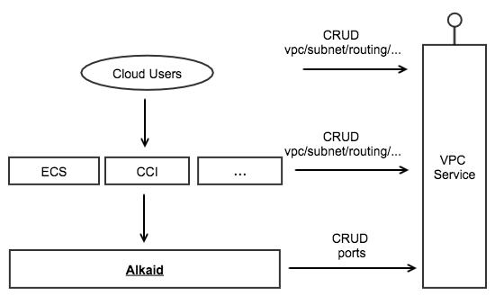
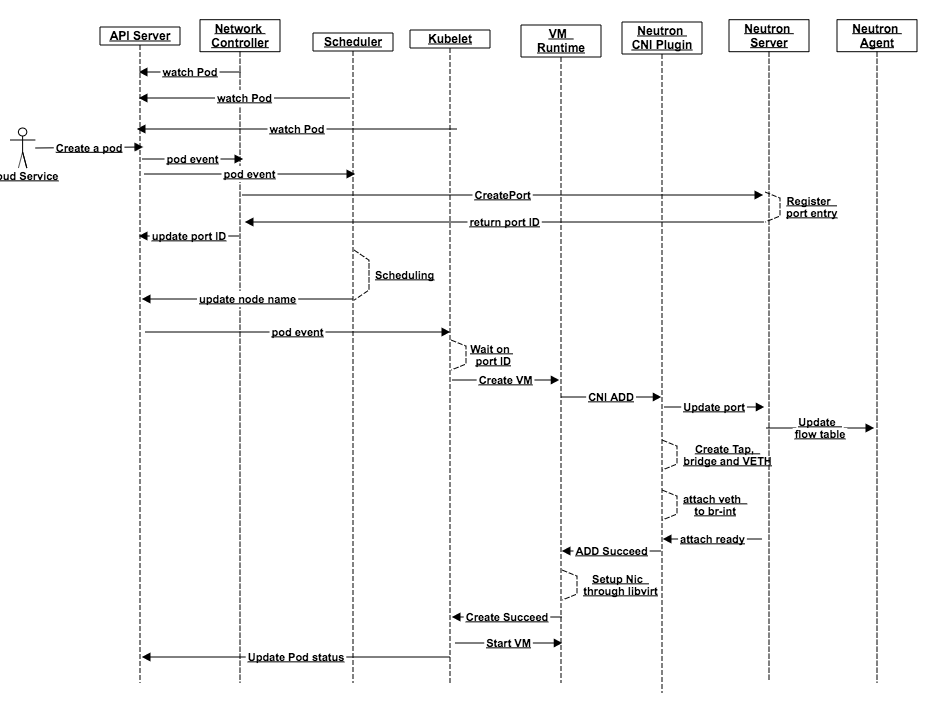
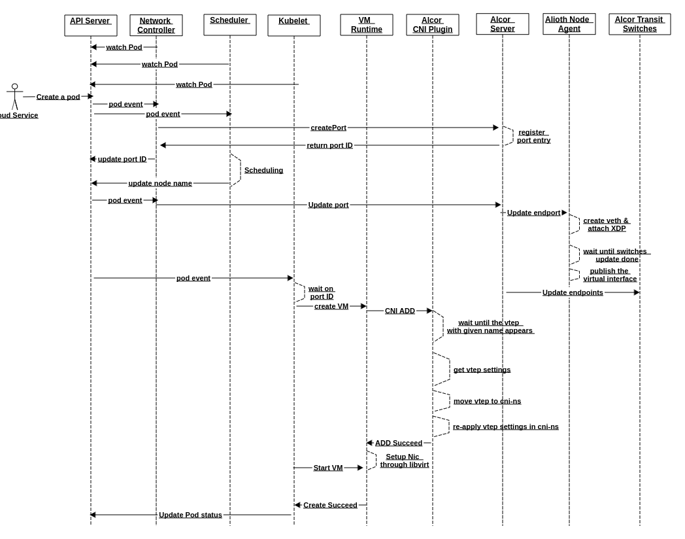
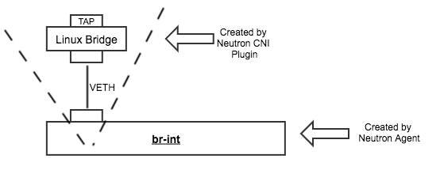

# NIC and VPC Support in Arktos

Xiaoning Ding, Hongwei Chen

This document describes the Network Interface Card (NIC) and Virtual Private Cloud (VPC) support in Arktos, including motivation, pod spec changes and component changes.

## Motivation

Arktos is evolved from Kubernetes with the goal to support VM and container workloads in a unified way. And it's designed for public cloud only. This brings some new requirements for networking:

* In Kubernetes a pod doesn't need to specify its IP and NIC configuration. It relies on the underlying container networking provider to dynamically assign IPs, usually through an IPAM plugin, and then create NICs. This is suitable for containers. However, for VMs it's common to have static IP and NIC configurations, especially for some legacy VM deployments.

* Kubernetes can run with different networking solutions for different scenarios. But Arktos is designed for public cloud only. Therefore, it's important to provide a native support for VPC networking of public cloud.

The rest of the document explains how Arktos supports NIC configurations on a pod, and how it interacts with VPC services to support NIC configurations.


## Overview

As an underlying cluster management system in cloud data centers, Arktos itself doesn't expose APIs to cloud users directly. Cloud users interact with public cloud services that are built on top of Arktos, such as ECS or CCI services. These services then in turn call Arktos APIs to manage workloads.

A workload in Arktos is represented by a pod. An Arktos pod can specify one or more **NICs**, and each Nic is mapped to a VPC **port** resource that is backed by a cloud VPC service. Users can associate a pod with an existing port, or let Arktos to dynamically create and delete ports for a pod.

A port is always attached to a certain subnet in a certain VPC, and may belong to one or more security groups. Lots of other VPC resources could impact the behavior of a VPC port as well, such as Network ACLs or Routing Rules. But the only VPC resource type that Arktos manages is port. All other VPC resource types (such as subnets or security groups) are managed:

* by cloud users directly calling VPC service APIs;
* Or by a cloud service such as ECS calling VPC service APIs.

The below diagram shows the relationship among these services:



Arktos supports different VPC implementations as long as they provide an API to manage the lifecycle of port resources. For now we support two different implementations:

* OpenStack Neutron
* Arktos Networking (Alcor)

Different VPC implementation has different data plane components on computing hosts, and this requires different operations to attach a workload to the network. Arktos leverages CNI plugin mechanism to support these different operations.


## Pod Spec Changes

Pod spec is extended to include two new fields:

* VPC field. For now, one pod only belongs to one VPC no matter how many NICs the pod has.
* NICs field. This is a list of NICs that belong to this pod. If no NIC is specified a default NIC will be added. The maximum allowed NIC number is determined by the VM flavor. For containers it will be determined by cluster configuration. 

NICs defined on a pod are shared by all containers inside the pod, or the single VM in the pod. 

Here are some sample pod YAML files: 

pod1.yaml: a container pod with one default NIC. 

```yaml
apiVersion: v1
kind: Pod
metadata:
  name: nginx
spec:
  containers:
  - name: nginx
    image: nginx
    ports:
      - containerPort: 443
  vpc: vpc-1a2b3c4d
```

pod2.yaml: a container pod with one single NIC. 

```yaml
apiVersion: v1
kind: Pod
metadata:
  name: nginx
spec:
  containers:
  - name: nginx
    image: nginx
    ports:
      - containerPort: 443
  vpc: vpc-1a2b3c4d
  nics:
    - subnet: subnet-1
```

pod3.yaml: a container pod with one single NIC, which has a specified IP. If the specified IP is not available in the specified subnet, an error will be raised.

```yaml
apiVersion: v1
kind: Pod
metadata:
  name: nginx
spec:
  containers:
  - name: nginx
    image: nginx
    ports:
      - containerPort: 443
  vpc: vpc-1a2b3c4d
  nics:
    - subnet: subnet-1
      ip: 192.168.0.12
```

pod4.yaml: a VM pod with one single NIC, which has a pre-created port object.

```yaml
apiVersion: v1
kind: Pod
metadata:
  name: nginx
spec:
  VirtualMachine:
    name: nginx
    image: www.foo.com/vmimages/nginx
    flavor: m1.large
    ports:
      - VMPort: 443
  vpc: vpc-1a2b3c4d
  nics:
    - portID: a2815656-76f7-46d4-9d11-057063db1a14
```
pod5.yaml: a VM pod with two NICs, one specified IP and security group, and one has a pre-created port object.

```yaml
apiVersion: v1
kind: Pod
metadata:
  name: nginx
spec:
  VMs:
  - name: nginx
    image: www.foo.com/vmimages/nginx
    flavor: m1.large
    ports:
      - VMPort: 443
  vpc: vpc-1a2b3c4d
  nics:
      - subnet: subnet-1
        ip: 192.168.0.12
        securityGroup: aa5db150-a63d-4bd1-8d70-2dff67c6a5d9
      - portID: a2815656-76f7-46d4-9d11-057063db1a14
```

A NIC can also have a name. If not specified it will be named "eth0", "eth1", ... and so on.

## Flows

This section describes the end-to-end flow for the pod creation, as it's the most complicated one involving almost all computing and networking components.

### Integration With Neutron

The below sequence diagram shows the flow with the example of a VM pod and the Neutron VPC service.




Flow explanations:

* First, scheduler, network controller and node agent establish the pod watch on the API Server.
* User submits a VM pod with NIC configurations.
* Both scheduler and network controller will get the new pod event. They work in parallel:
  * Scheduler will find a node to run the pod and update the nodeName field.
  * Network controller will inspect the NIC section in pod spec. If any NIC doesn't have a portID there, it means the port hasn't been created. It will call Neutron service API to create the port, and update the port ID in pod status.
* Node agent will receive the pod event after the NodeName field is updated by scheduler. It checks PodStatus to ensure all NICs have port ID ready, and then call the VM runtime to create the VM.
* VM runtime calls CNI plugin to prepare NICs.
* The Neutron CNI plugin will call Neutron API to bind the port object. Basically, this is to tell Neutron that the port will be placed on current host.
* The Neutron CNI plugin then creates per-port items: a tap, a Linux bridge and a veth pair. These items will follow the naming convention based on port ID. And they will be attached to the br-int OVS bridge created by Neutron agent.
* After the Neutron agent detects that the veth has been attached to the br-int bridge, it will get the flow table changes from the Neutron server and then programmed these rules into its OVS bridges.
* After the Neutron CNI plugin receives the Neutron notification that all flow update is done, it returns and the TAP device is ready for a VM to use.
* The VM runtime performs some necessary wiring work to connect the TAP device to the QEMU VM.

### Integration with Alcor

Here is the sequence flow in the case of Alcor VPC service:



As you can see most parts of the flow are same, including pod watching, calling VPC API, etc. The difference is mainly about how Alcor updates ports and how Alcor CNI plugin works:

* Alcor CNI plugin identifies the virtual interface (a veth vtep inside the VPC specific netns) that Alcor control plane has provisioned, and move the virtual interface to the desired CNI netns, restores its network related setting like ip address, mac address, gateway, etc. This is quite different from the Neutron case where CNI plugin has to create quite many devices like tap/bridge/veth pair, Alcor CNI plugin does not create new device, instead it moves the identified device to the target netns, ensuring proper device configurations after the netns move.
* Alcor control plane will update Mizar dataplane to ensure packets are correctly forwarded, and also notify Alcor Control Agent to create the new endpoint, which CNI plugin is expecting.

The section of Alcor CNI plugin also describes the interaction.

## Code Changes


### New Types in API Server

The following code changes are required in API server to introduce the new types:

* Define a new type **v1.Nic** and **v1.NicList**. 
* Update **v1.PodSpec** type to include a list of Nics. 
* Update **v1.PodStatus** type to include **v1.NicStatus**, which includes some internal data and flags associated with this NIC and port.

Codes to handle validation and defaults for the new types:

* Update the Pod spec validation part to valid that NICs field is well-formed. 
* Assign default values to un-assigned fields.

### Admission Controller

Some additional checks need to be done in an admission controller:

* Check if the NIC number exceeds the maximum allowed number according to VM flavor, container policies, or tenant quotas.

### Controller Manager

A new Arktos controller, network controller, will be introduced to create ports and delete ports.

Here is what the new network controller needs to do:

* Watch all pods.
* For a new pod: 
	* If any NIC in the pod doesn't have an associated port ID, call VPC API to create the port for this NIC.
	* Update pod spec and status to persist the associated port ID, and also a flag to indicate this port is created by the controller.
	* Poll the VPC API and update port status in the pod.
* For a pod pending deletion: 
	* If any NIC in the pod has the flag indicating the associated port was created by network controller, call VPC API to delete the port object.
	* Update pod spec and status to remove port ID and flag.

### Node Agent

Node agent needs to do the following changes:

* For a scheduled pod, the agent needs to wait all Nics to have their port IDs assigned and port status is ready. 

This is similar to the case of volume mounting where it needs to wait controllers to attach the volume first.

### VM Runtime

Our VM runtime is evolved from the Virtlet project. It currently creates a bridge to connect the created CNI interface and VM NIC device.

The following changes are required:

* Pass the Nic configurations to CNI plugin through its **Extra Arguments** field.

### Neutron CNI Plugin

A new CNI plugin needs to be implemented to interact with the Neutron data plane components on Arktos hosts. 

On a computing host Neutron agent has already setup required OVS bridges (br-int and br-tun) when it initializes. What the CNI plugin needs to do is initializing the per-port components and attaching/detaching it from these OVS bridges.

When CNI **ADD** method is called:

* Retrieve the port ID from NIC configuration, which is passed from the **Extra Arguments** field. 
* Create a TAP device, a Linux Bridge and a veth pair, and then connect one end of the veth pair to the **br-int** OVS bridge.
* Wait until the port status becomes ready.

When CNI **DEL** is called:

* Detach the veth from the br-int OVS bridge.
* Delete the TAP device, Linux Bridge and veth pair created in the CNI ADD method.

The below diagram shows the ownership of above devices:



### Alcor CNI Plugin

Alcor has a much-simplified data plane components on each computing host. It basically creates a veth pair for each port, attaches its eBPF program to one end of the pair, and leaves the other end of the pair to pods. The other end of the veth pair will be listed in the host namespace as a virtual interface.

The current agreement between Arktos and Alcor is:

* The virtual interface will follow a naming rule. For example, "veth{11-char-prefix-of-portID}".
* Alcor agent puts the virtual interface inside of VPC specific netns. The name of VPC specific netns should be "vpc-ns{full-vpc-id}"
* Once the virtual interface (one end of the veth pair created by Alcor agent) appears inside of the VPC netns, it means the preparation work on Alcor side has been done and the port is ready for Arktos to use.

Therefore, the Alcor CNI plugin only needs to query and wait until a virtual interface with the expected name appears in the host namespace.

## Appendix: Design Decisions

This section documents some important design decisions we made and the rationale behind the decisions.

### Which component should manage port resources

Port resources can be created and deleted by a network controller (option A), or node agents (option B). Each design option has its pros and cons. 

There are far more instances of node agents than network controllers. Therefore option B can naturally distribute the job of port manipulation, but on each node it requires deploying credentials to the VPC API endpoint.   

We decided to manage port resources in network controller due to the following reasons:
  
  * Controllers have advantages to handle situations that a computing node is crashed. This is similar to attaching and detaching volumes in controllers.
  * We want to reduce the attack surface and avoid deploying network credentials on each node.
  * Network controller itself will have multiple instances to support high availability and distributing workloads. And calling VPC API to manage port lifecycle isn't a resource-heave operation. Therefore scalability shouldn't be a concern.
  * Controllers can potentially do some batch operations, like creating a bunch of ports for different pods with one API call.
