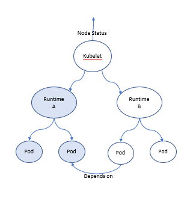

# Partial Runtime Readiness Handling in Arktos Node Agent

## Motivation
In Arktos, multiple runtime services can be registered on the node to support different workloads, i.e. containers, VMs 
and bare-metal machines (for details, please refer to the "Multiple Runtime Services Support" design spec). With multiple 
runtime services registered on a node, a runtime service can be added or removed, and the state of the service can be 
ready or notReady. As a result, the node status and node readiness management need to be updated to support those
situations on the node, and the pod placement logic at the scheduler needs to be changed to ensure POD was scheduled to 
a node with desired runtime service.

Arktos is currently implemented as "NodeReady when ANY one of its runtime services is ready" for best resource 
utilization, i.e. the scheduler can schedule the pod to a node as long as its desired runtime service ready on the node.
However, this implementation carries a drawback where pods have cross workload type dependencies. Consider a case with 
Alcor network agent below:

A cluster is setup with two runtime services, containerD and Arktos VM runtime, for container and VM workload types 
respectively. The network agent of the cluster, i.e. Alcor agent, is deployed as a container workload daemonset on each
nodes as long as the containerD runtime service is ready.

Some nodes can be set as "Ready" with VM runtime service ready, even the Alcor network agent is not deployed on them. 
As a result, a VM pod can be scheduled onto them. However the VM will not run due to the network agent not exist.
 
The following diagram illustrates the node status dependency, and cross workload type pod dependencies.

This doc describes the proposal of the partial runtime readiness handling feature, including:
1. Node readiness criteria with multiple runtime services, with the Primary Runtime concept.
2. Node runtime readiness state reported as part of the nodeStatus, nodeConditions.
3. New scheduler predicate function for runtimeReadiness check

## Requirements, principles and terminologies
### Primary runtime of a cluster
A primary runtime is the runtime service used for Kubernetes system daemon pods, pod with kube-system namespace, or system
workload that all other tenant workload pods rely on. In Arktos, the default primary runtime service is container workload 
runtime service, because:

1. Container workload is a simpler way to implement the daemonset pod than VM workload. 
2. Currently Kubernetes daemonset pods are container based, default to container workload will make the migration to Arktos
   more straightforward. 

### Runtime service state and state changes
1. A Runtime service can be added or removed from a node
2. A runtime service state can be at Ready, NotReady or Unknown; where Ready means both network and compute ready for 
the runtime; NotReady means one of them or neither of them are ready in a particular runtime service. Unknown is the initial
state of any given runtime services, and indicates state of a given runtime is not set due to various reasons, such as 
error querying runtime service endpoint.
3. A runtime service state change can be Ready->NotReady OR NotReady->Ready

### Node Readiness
1. A node Ready as long as the primary runtime service is ready, regardless of the state of the other registered runtime
services on the node. i.e. cluster is ready to serve the same workload type its system pod workload type. 
2. A graceful period of runtime NotReady will not trigger node from Ready to NotReady state. e.g. An interim primary 
runtime service glitch WILL NOT change node Readiness. Graceful period can be defined as 
N x node-status-update-period.  (Details to be defined)

## Goal and no-goals

### Goals
1. A pod shall be scheduled to a node where the desired runtime service exists AND ready per the node status at API server 
   at the time when the POD is being scheduled.
2. Runtime service statuses should be reported in a timely manner to avoid long delay of actual runtime status reported into
   API server.

### No-goals
1. Pod(workload) migration flow is not in scope
2. Pod(workload) eviction flow is not in scope
3. Handle runtime service failures is not in the scope

## Proposal

### APIs and internal data structures
No API level change
      
#### Internal data structure
1. Runtime service new field: isPrimary

        type runtimeService struct {
            name         string
            workloadType string
            endpointUrl  string
            serviceApi   internalapi.RuntimeService
            isDefault    bool
            // primary runtime service is the runtime for Kubernetes system, Daemonset workload containers
            // primary runtime service must be ready for node readiness condition
            isPrimary    bool
        }
    
2. Expand NodeCondition array with NodeContainerRuntimeReady and NodeVmRuntimeReady conditions   
   
       // registered runtime readiness for each workload type
        NodeContainerRuntimeReady NodeConditionType = "ContainerRuntimeReady"
        NodeVmRuntimeReady        NodeConditionType = "VmRuntimeReady"

### Component changes

### Kubelet
1. Define isPrimary

    Parser change to get the isPrimary field from Kubelet command line parameters. If it is not specified by the cluster 
    admins, set default to Container runtime.
    UpdateRuntimeUp() function with new NodeReady runtime criteria with primary runtime service ready.
    
3. NodeStatus setter for runtime services

        // RuntimeServiceCondition returns a Setter that update the v1.RuntimeServiceState condition array on the node
        // the conditions defined in v1.types as:
        // ContainerRuntimeReady NodeConditionType = "Ready"
        // VMRuntimeReady NodeConditionType = "Ready"
        func RuntimeServiceCondition(nowFunc func() time.Time, // typically Kubelet.clock.Now
        	runtimeServiceStateFunc func() (map[string]map[string]bool, error),
        	recordEventFunc func(eventType, event string), // typically Kubelet.recordNodeStatusEvent
        ) Setter {
            // Setter logic
        }

### Scheduler
A new predicate function, as well as code to enable the new predicate function.

    // CheckNodeRuntimeReadiness checks if the desired runtime service is ready on a node
    // Return ture IIF the desired node condition exists, AND the condition is TRUE
    func CheckNodeRuntimeReadinessPredicate(pod *v1.Pod, meta PredicateMetadata, nodeInfo *schedulernodeinfo.NodeInfo) (bool, []PredicateFailureReason, error) {
    	// Predicate code
    }

## Discussion
#### NodeSelectorPredicate vs. NodeConditionCheckPredicate
Even node selector is commonly used to predicate pod-node binding for some special situations, such as current virtlet 
Daemonset deployment uses extraRuntime=virtlet as the node selector to ensure the Virtlet runtime service is deployed 
only on the node with the label. However, given the nature and the current code flow on node readiness with its runtime 
service state, it is favored to expand the node condition check predicate function as the scheduler for this purpose. 
so that the node status update routine won't need to update the node labels when runtime state changes, and the POD 
won't need to explicitly set nodeSelector labels ( either by pod developers or by the internal code logic in Kubelet 
per the workload in the pod spec.)

#### Handling node condition update delays
Currently the node conditions are updated every 10 seconds as default Kubelet configurations. so when a runtime state
changes, either from Ready-NotReady or vise versa, there exists the 10 seconds window (worst case) where the scheduler can
make incorrect choice to bind a pod to a non-desirable node. Even the Kubelet re-run the predicate functions and reject
the pod, it is not ideal. one mitigation could be reporting the runtime service state (and also the nodeReadiness conditions)
as soon as the state changes to minimize the time window. However, this approach might introduce some false positive/negative
situations when the runtime service has a short glitch, e.g. the RPC call to query its state failed due to whatever reasons.
Some more research is needed in this area as future works.