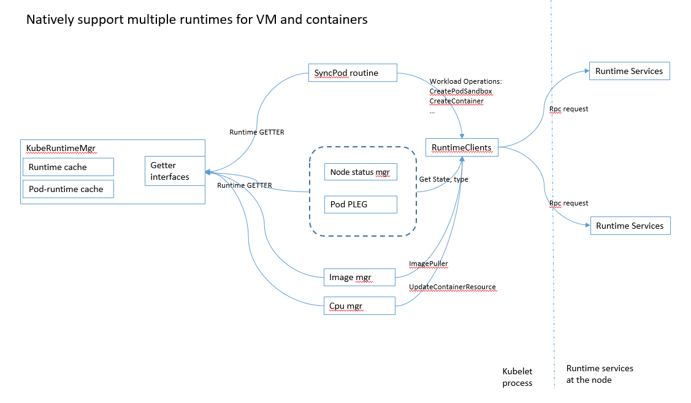

# Multiple CRI runtime endpoint support in Arktos node agent

## Motivation
Arktos is a unified compute platform to support both container and virtual machine based workloads and at the same time provides superior 
resource allocation efficiency in the cluster along with support for large scale cluster environment. Therefore, Arktos node 
agent needs to support both virtual machine and container runtime services, not only for containerized applications 
which typically run within virtual machines, but also to support those workloads in a native way, which, in our opinion, should
have the following characteristics:

1. Both virtual machine and container workloads are first class citizens and can be directly provisioned from the 
   underlying hypervisor layer, with optimized provision performance
2. Being a platform to support both VM and container workload, with large scale in terms of # of VM being orchestrated
   and managed by the system and node agent
3. Rich status/state for both VM and container workload types
4. Node agent be able to maintain/manage the life cycle of the workload types, query the workloads from the underlying
   runtime services, despite of agent rebooting situations.

This spec describes the proposal for the phase 1, to extend the current Kubernetes to support multiple runtime services by 
extending the current GenericRuntimeManager type and runtime manager interfaces.

### Related works
Kubernetes RuntimeClass feature was originally introduced in Kubernetes release 1.12 and has matured to beta in Kubernetes release 1.14.
It allows cluster admins to provide RuntimeClasses to expose the multiple configurations of the CRI runtime service and
the POD (workload) to specify the desired configuration to run the containers specified in the POD. It also opened 
up ways for dynamic scheduling logic for a POD to node with the specific runtime configurations. However the 
runtimeClass is designed merely for containers and depends on CRI implementations and configurations. It does not fit the
requirements for Arktos in order to support virtual machine runtime service natively.

Mirantis CRI Proxy, along with its CRI implementation(Virtlet) provides a way to run multiple CRI implementations on 
the node. Essentially it provides a layer between the node agent and multiple CRI implementations. By intercepting the 
gRPC call from node agent, the CRI proxy redirect the CRI request to the desired CRI service and returns the response to 
the node agent. It provides a decent way to run multiple CRI services at the node without change the Kubelet internal 
logic. However, the CRI proxy has few limitations which do not meet Arktos's requirements:

1. It is designed merely for CRI implementation, with all the internal logic in Kubelet, it will be hard support virtual 
   machine runtime services natively
2. Extra latency due to extra layer of interposes communications
3. Additional maintenance and management cost at the node

## Goal and no-goals

### Goals
1. Provide initial work to satisfy the characteristics of natively supporting multiple workload types, by allowing multiple
   runtime endpoints configured by Cluster Admins and POD can choose desired runtime service to run
2. Legacy cluster(Kubelet commandline) should continue to work with the code change
3. Legacy applications(without the runtimeServiceName) should continue to work in Arktos cluster

## Proposal

It is proposed to enhance the current GenericRuntimeManager implementation in Kubelet with a set of runtime management interfaces to 
"late-bind" the runtime service with particular pod/workload. A few key design points are listed below:

1. GenericRuntimeManager type implements the RuntimeManager interface methods for late-binding POD and runtime service
2. GenericRuntimeManager type maintains a cache of POD-Container to its runtimeService. The cache is updated (Add and remove)
    per POD creation and termination. The runtime manager GETTER interface will retrieve runtime service for a pod 
    from the cache, and if not found, then query the runtime service.
3. Node runtime state UP means all runtime services are up and ready (network and compute), ERROR is anyone of them failed.
4. Node status reports status for all runtime services
5. The same approach applies to the imageService as well.
   
The diagram below illustrate the API calls with the multiple runtime support at the Kubelet level, this includes:
1. workload(pod) orchestration APIs, e.g. CreatePodSandbox, CreateContainer etc
2. workload(pod) status and runtime state, version related APIs
3. workload(pod) resource consumption update API
4. Image puller and image related APIs

#### Runtime service registration
1. Static registration by passing in from node agent commandline parameters

    --container-runtime = remote

    --container-runtime-endpoint = workloadType:runtime1:endpointUrl1;workloadType:runtime2:endpointUrl2

    The cluster admin is responsible to provide unique names and endpoint URLs for the service endpoints.

#### Defaults and backward compatibility with legacy applications
1. If podSpec.runtimeServiceName is specified, node agent will use the runtimeService. if not, it will choose the default
   runtime service per the workload (VM or container)
2. The first runtime endpoint specified in the agent commandline is assumed as the default one for each workload types
3. The "default" string of runtimeName in the node agent commandline is reserved and should not be used by the node agent
   commandline.
4. If no image service endpoints are specified in the node agent commandline, image service will be default to its 
   corresponding runtime service.

### APIs and internal data structures
#### Sample pod with specific runtime service

    apiVersion: v1
    kind: Pod
    metadata:
      name: vm-with-nic-portid
    spec:
      virtualMachine:
        name: testVM
        image: cloud-images.ubuntu.com/xenial/current/xenial-server-cloudimg-amd64-disk1.img
        resources:
          limits:
            cpu: "1"
            memory: "1Gi"
          requests:
            cpu: "1"
            memory: "1Gi"
      vpc: demo
      nics:
        - portId: 04fe371d-fddf-43c4-9419-b7d9cd4a2197
      # optional
      runtimeServiceName: libvirt-qemu
      
#### Internal data structure
New data structures maintained by the GenericRuntimeManager:
    
    type runtimeService struct {
        name         string
        workloadType string
        endpointUrl  string
        serviceApi   internalapi.RuntimeService
        isDefault    bool
    }
    
    type imageService struct {
        name         string
        workloadType string
        endpointUrl  string
        serviceApi   internalapi.ImageManagerService
        isDefault    bool
    }
    
	// gRPC service clients
	runtimeServices map[string]*runtimeService
	imageServices   map[string]*imageService
	
	// Pod-runtimeService maps
    // Runtime manager maintains the pod-runtime map to optimize the performance in Getters
    // key: podUid string
    // value: runtime service API
	podRuntimeServiceMap map[string]internalapi.RuntimeService
	podImageServiceMap   map[string]internalapi.ImageManagerService
	
	
In addition to the current runtime interfaces which is defined in the kubelet/container/runtime.go file, a new set of 
runtimeManagement interface is defined and implemented by the GenericRuntimeManager type.
    
    // Interfaces for kubeGenericRuntimeManager
    type RuntimeManager interface {
    	// Ge all runtime services supported on the node
    	GetAllRuntimeServices() ([]internalapi.RuntimeService, error)
    
    	// Get all image services supported on the node
    	GetAllImageServices() ([]internalapi.ImageManagerService, error)
    
    	// Get the desired runtime service as needed. late binding the runtimeService to the pod
    	GetRuntimeServiceByPod(pod *v1.Pod) (internalapi.RuntimeService, error)
    
    	// Get the desired runtimeServie with the POD ID
    	GetRuntimeServiceByPodID(podId kubetypes.UID) (internalapi.RuntimeService, error)
    
    	// Get the desired image manager servcie as needed. late binding with the pod
    	GetImageServiceByPod(pod *v1.Pod) (internalapi.ImageManagerService, error)
    
    	//Get the status of the given runtime
    	RuntimeStatus(runtimeService internalapi.RuntimeService) (*RuntimeStatus, error)
    
    	// Get the version of the given runtime
    	RuntimeVersion(service internalapi.RuntimeService) (Version, error)
    
    	// Get the typed version from the runtime service
    	GetTypedVersion(service internalapi.RuntimeService) (*runtimeapi.VersionResponse, error)
    }

### Component changes
All changes to support multiple runtime services in current milestone are in Kubelet, in addition to the essential type 
changes in the POD SPEC to add the runtimeServiceName field and scheduler changes as described in the design 
consideration section. 

The Kubelet changes can be categorized into a few areas:
1. KubeRuntimeManager with runtime manager interface implementations and runtime service cache management
2. Runtime service consumers like PLEG, statusManager, CpuManager changes to late-bind the POD and runtime service
3. NodeStatus runtime service state reports and node status report

## Future works
1. Dynamic registration via a runtime registration framework

   With the static runtime service registration, the node agent has to be restarted to load the new runtime service when 
   a new runtime service is installed and available on the node. This is not ideal because it introduces downtime at the 
   node agent. (Future work) Arktos node agent provides registration framework to allow dynamic registration of runtime 
   service to avoid unnecessary downtime.
2. Advertise the supported runtime services to Arktos users

   For the first release, this can be as simple as documentation to list the supported runtime services for container and
   virtual machine workloads. For future releases, a configMap can be used so Arktos users can query the supported runtime
   services in the cluster.
3. Support partial runtime services readiness
      
   Currently With multiple runtime services at the node, the node readiness will depend on all registered runtime services 
   to be ready, including compute and network of each runtime services. VersionInfo, runtime service typeInfo of the node 
   will include all registered runtime services as well. i.e.
   
      NodeReady means: all registered runtime services ready
      NodeStatus: VersionInfo, TypeInfo for all registered runtime services
   
   It will make the node more useful in the Cluster if the node is not marked as down only when one of its runtime service
   is not ready, i.e. support partialReady of node runtime services.
   
   A PartialReady of node can be introduced to make the node available when at least of the registered runtime service 
   is ready. A periodical probe and update of runtime service health will be needed at the node agent.

4. Keep in-sync with resource usage in Kubelet and runtime services  

   The CRI allows one to update the container resource usage via its UpdateContainerResources interface, for example the 
   CPU usage state, will also be updated per the workload. with multiple runtime services at the node, the resource 
   consumption of the node will be, to use CPU as an example:
       CPU usage of the node from CPU manager = sum ( CPU usage in all runtime services)
   which means, querying one runtime service for resource consumption is no longer reflects the actual resource usage at 
   the node any more. New logic is needed with multiple runtime services at the node.
   
5. Add VM runtime interfaces, separate VM runtime interface from CRI (which is for containers)
